# GitHub Copilot Token Usage Simulator - Flow Diagrams

These diagrams translate [GitHub-Copilot-Token-Usage-UBB-and-Policy-Analysis.md](GitHub-Copilot-Token-Usage-UBB-and-Policy-Analysis.md) into an implementation blueprint. The simulator should keep **access decisions**, **token pricing**, **credit allocation**, and **secondary Actions usage** separate so each result is explainable.

## 0. Guardrail analysis

The simulator must distinguish **attribution**, **entitlement**, **hard stops**, **soft limits**, **alerts**, and **cost optimizations**. They have different semantics and cannot be represented by one `passed` flag.

### 0.1 Guardrail taxonomy

| Class | Controls | Evaluation behavior |
|---|---|---|
| Entitlement | Plan, active paid seat, organization access, subscription/billing state | Hard block before pricing |
| Effective ULB | Individual ULB, cost-center ULB, universal ULB | Exactly one wins by specificity; always a hard stop; applies to pool plus metered credits |
| Included allocation | Enterprise shared pool, cost-center included-usage control | Pool allocation; cost-center control can block or route overflow to paid usage |
| Paid-usage authorization | `AI credits paid usage` policy | Hard block before any metered charge, regardless of spending budgets |
| Metered spending limits | Cost-center, organization, enterprise budgets | All applicable limits constrain usage; only hard stops when `Stop usage...` is enabled |
| Cost-center isolation | Direct/team/org attribution, included cap, cost-center exclusion | Determines which controls and ledgers apply; exclusion removes the enterprise metered-budget constraint |
| Product/SKU scope | Copilot AI credits, Spark AI credits, cloud agent, bundled AI credits | A budget applies only when its product/SKU selector matches the request |
| Individual overage | Additional-usage cap, unpaid balance, authorization hold, mobile purchase restriction | May block individual plans independently from enterprise controls |
| Session/runtime | CLI max-credit soft limit, IDE max requests, subagent depth, cloud-agent timeout | Soft stop or hard technical stop within a task/session |
| Policy | Enterprise, organization, repository, user, managed client | Resolves by policy-specific precedence before use |
| Content/safety | Content exclusion, public-code handling, responsible-AI filters | Block, redact, or annotate depending on feature and client |
| Availability | Network, TLS, authentication, SSO, rate limit, model/region/provider | Hard or retryable block |
| Secondary meters | Actions allowance, Actions budget, runner price/availability | Separate allowance and budget decision after feature eligibility |
| Optimization | Auto model selection, model restrictions, cache preservation, lean tools | Changes expected consumption; not itself a spending authorization |
| Notification | 75/90/100% budget alerts; product-specific included-usage alerts | Emits events; never blocks by itself. AI-credit pool-depletion alerts are unverified |

### 0.2 The central corrections

1. **ULB is not one remaining number without identity.** Resolve the applicable user, cost center, and billing cycle, then select `individual > cost-center > universal`. The selected ULB tracks the user's total consumption across included and metered phases.
2. **A cost-center budget and cost-center ULB are different controls.** The ULB is a per-member total-credit hard stop. The cost-center budget is a group-wide metered-dollar limit and is alert-only unless its stop flag is enabled.
3. **Cost-center attribution precedes budget resolution.** Direct user assignment wins, then enterprise-team assignment, then the organization granting the Copilot license. Multiple team assignments use the earliest-created applicable team. Multiple licensing organizations may make organization attribution cycle-dependent. Source: [Cost center allocation for different products](https://docs.github.com/en/billing/reference/cost-center-allocation).
4. **The enterprise budget remains relevant to cost-center and organization usage.** By default their metered usage counts against the enterprise budget. Cost-center exclusion explicitly removes that enterprise constraint.
5. **"Lowest remaining headroom wins" requires evaluating all applicable hard constraints.** Do not pick one budget and ignore the rest.
6. **Included-usage controls are computed, not freely entered.** Their cap derives from active Business and Enterprise licenses assigned to the cost center; increases apply immediately, decreases and member moves apply next cycle.
7. **Budget applicability has more than an owner scope.** Product, SKU, effective date, creation date, billing entity, and cycle must also match.
8. **Unknown is not pass.** Undocumented amounts, unresolved multi-org attribution, absent live state, or ambiguous policy precedence must produce an explicit assumption or `indeterminate` result.

### 0.3 Guardrail evaluation phases


## 1. End-to-end simulation

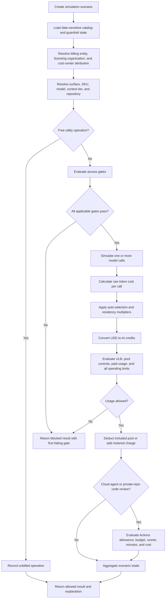

## 2. Access-gate pipeline

The simulator stops at the first failing gate and preserves the gate number, reason, and remediation. Gates that do not apply to the selected surface are recorded as `not_applicable`, not silently omitted.

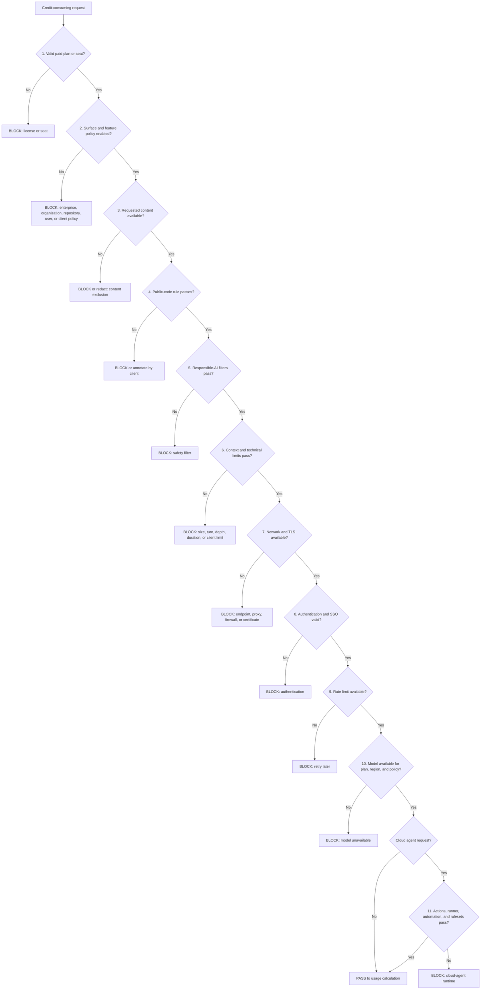

Budget checks occur after the estimated call cost is known. A zero-dollar user budget can be preflighted earlier, but the simulator should still report it through the budget flow below.

## 3. Per-call token and credit calculation

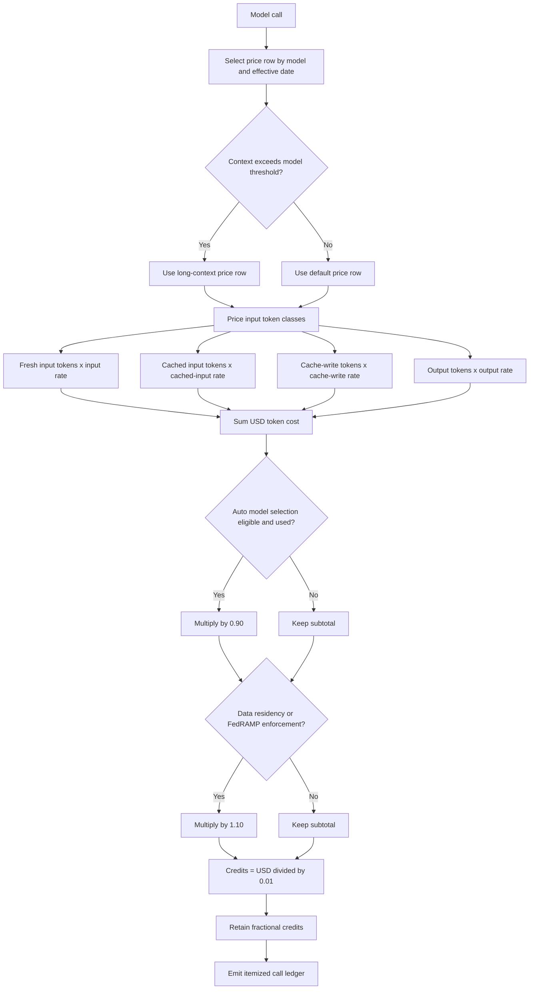

```text
raw_usd =
    fresh_input_tokens * input_usd_per_million / 1_000_000
  + cached_input_tokens * cached_input_usd_per_million / 1_000_000
  + cache_write_tokens * cache_write_usd_per_million / 1_000_000
  + output_tokens * output_usd_per_million / 1_000_000

adjusted_usd = raw_usd
  * (auto_model_selection ? 0.90 : 1.00)
  * (residency_enforcement ? 1.10 : 1.00)

ai_credits = adjusted_usd / 0.01
```

Reasoning tokens should be included in the supplied output-token count unless a future authoritative price field distinguishes them. Rounding is undocumented, so the simulator must retain decimal precision and label any display rounding as a presentation choice.

Treat billing reasoning tokens at the output rate and simultaneous application of auto-selection and residency multipliers as explicit, configurable assumptions. GitHub documents that these settings increase token consumption and documents each multiplier independently, but does not document reasoning-token price class or multiplier interaction.

Cached-input rates belong to each model price tier. Do not hardcode 10%: xAI uses 25% of input price while the documented models from other providers use 10%.

## 4. Agentic loop and cache behavior

Every model call is billable, including calls triggered after tools and calls made by subagents.

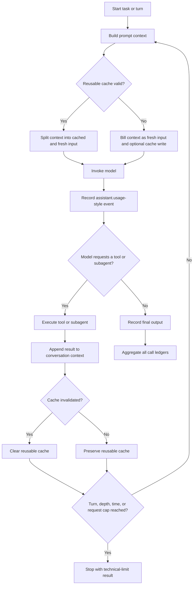

Cache invalidation inputs should include model changes, reasoning-effort changes, context-size changes, enabled tool or MCP changes, explicit compaction boundaries, and provider inactivity expiry.

## 5. Attribution and economic guardrails

### 5.1 Cost-center attribution

Attribution is effective-dated. It determines the cost-center ULB, included-usage control, cost-center spending limit, enterprise-budget exclusion, and ledger destination.

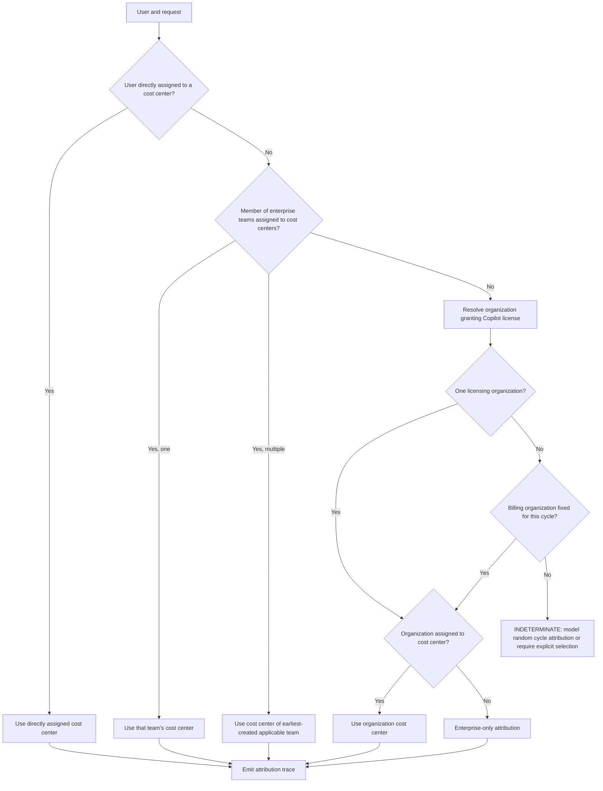

### 5.2 Effective ULB resolution

ULB limits are per user and per billing cycle. Values should retain both the configured limit and consumption-to-date, not only a caller-calculated remaining balance.

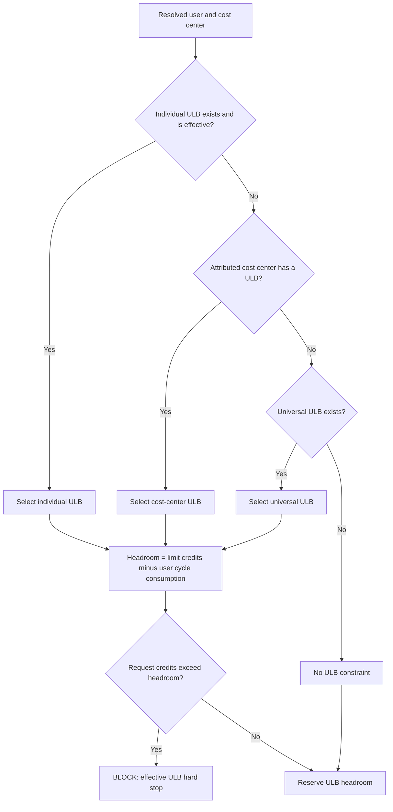

A `$0` ULB blocks immediately. Raising a cost-center or enterprise spending limit cannot override an exhausted ULB.

### 5.3 Shared pool and cost-center included-usage control

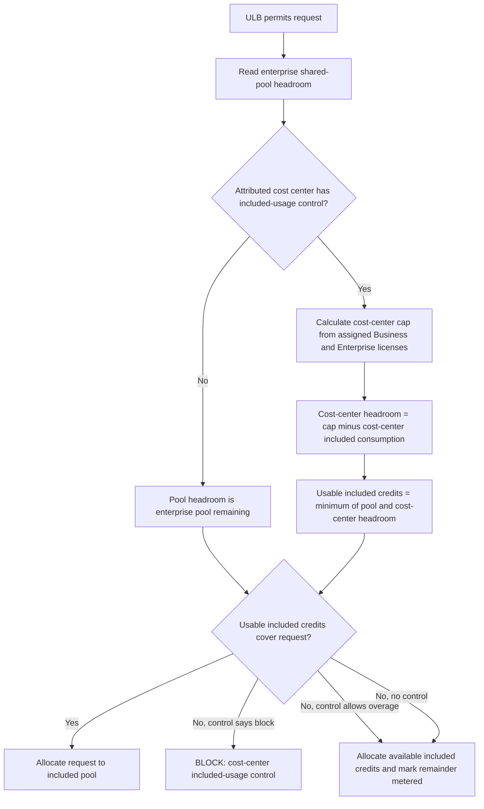

The cost-center included cap is `Business seats x 1,900 + Enterprise seats x 3,900` under the standard 1 September 2026 allowance. It must be effective-dated. License additions/upgrades increase it immediately; removals/downgrades and moves between controlled cost centers decrease/reallocate it next cycle. Enabling the control is not retroactive.

Whether a single request can split between the final pool credits and metered credits is not documented. Preserve configurable `split` and `meter-entire-request` modes and mark the selected mode as an assumption.

### 5.4 Paid usage and applicable metered limits

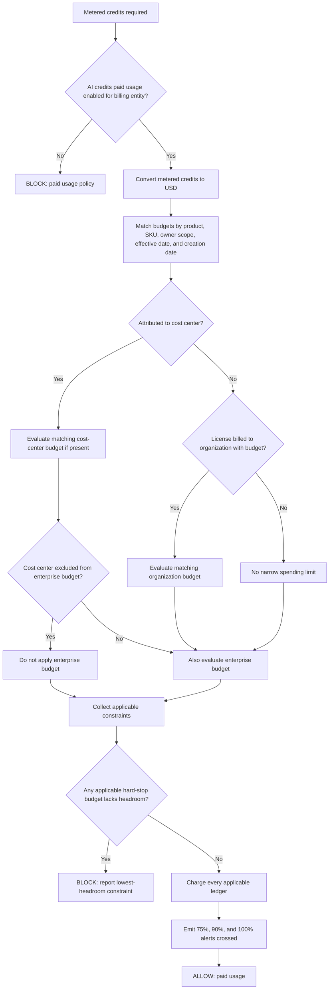

An exhausted spending limit with `Stop usage when budget limit is reached = off` is an alert-only threshold and charges continue. The default is off. A `$0` applicable budget blocks only when it is a hard-stop control; ULBs are always hard stops.

Cost-center and organization budgets are **narrower constraints**, not replacements for the enterprise failsafe. By default their metered charges count against the enterprise budget too. Organization budgets can further restrict an enterprise control but cannot loosen it. Cost-center exclusion is the explicit exception.

The first cycle after budget creation needs a `trackingStartedAt` or baseline: usage before creation does not count toward that budget, so apparent first-cycle overshoot is valid.

### 5.5 Guardrail applicability dimensions

| Dimension | Examples |
|---|---|
| Billing entity | Individual, organization, enterprise |
| Owner scope | User, cost center, organization, enterprise, repository where supported |
| Product/SKU | Copilot AI credits, Spark AI credits, cloud agent, bundled AI credits |
| Effective interval | Created, changed, deleted, cycle start/end |
| Consumption phase | Included pool, metered, both |
| Enforcement | Hard stop, soft stop, alert-only, observe-only |
| Attribution | Direct user, enterprise team, licensing organization, enterprise-only |
| Exclusion | Cost-center metered usage excluded from enterprise budget |

### 5.6 Individual-plan overage

Individual plans require a separate path: included allowance, additional-usage eligibility, possible additional-usage cap, outstanding payment, authorization hold, and purchase-channel restriction. Mobile iOS/Android subscribers cannot buy extra credits. Unknown provider caps must remain `unknown`, not be treated as unlimited.

### 5.7 BYOK

Copilot SDK BYOK bypasses GitHub Copilot authentication and AI-credit billing and instead bills the model provider. It remains subject to applicable GitHub content filtering and configuration policy. IDE and enterprise BYOK billing behavior is not fully documented and must produce `indeterminate` unless explicitly configured.

## 6. Monthly allowance lifecycle

```mermaid
stateDiagram-v2
    [*] --> ActiveCycle
    ActiveCycle --> PoolUsage: allowed included request
    PoolUsage --> ActiveCycle: pool remains
    PoolUsage --> MeteredUsage: pool exhausted and paid usage enabled
    PoolUsage --> Blocked: pool exhausted and paid usage disabled
    MeteredUsage --> MeteredUsage: budget permits overage
    MeteredUsage --> Blocked: hard-stop budget reached
    ActiveCycle --> Blocked: user-level budget reached
    Blocked --> ActiveCycle: administrator raises applicable budget
    ActiveCycle --> Reset: midnight UTC on day 1
    MeteredUsage --> Reset: midnight UTC on day 1
    Blocked --> Reset: midnight UTC on day 1
    Reset --> ActiveCycle: pool and ULB consumption reset; unused credits forfeited
```

Plan renewal, upgrade, downgrade, trial conversion, or resumption does not trigger `Reset`. Seat additions may increase or prorate the pool immediately; seat removals take effect for allowance purposes in the next cycle. Cost-center membership and license changes need their own effective timestamps because pool entitlement, attribution, and included-usage-control caps do not all change at the same time.

### 6.1 Session and runtime guardrails

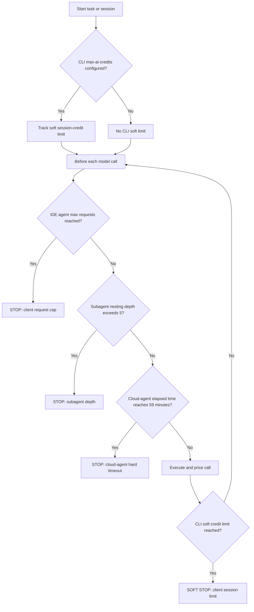

The CLI limit is a public-preview soft limit. Rate limits are separate, may apply even when credits remain, and have no reliable published numeric thresholds.

### 6.2 Actions as a separate guardrail path

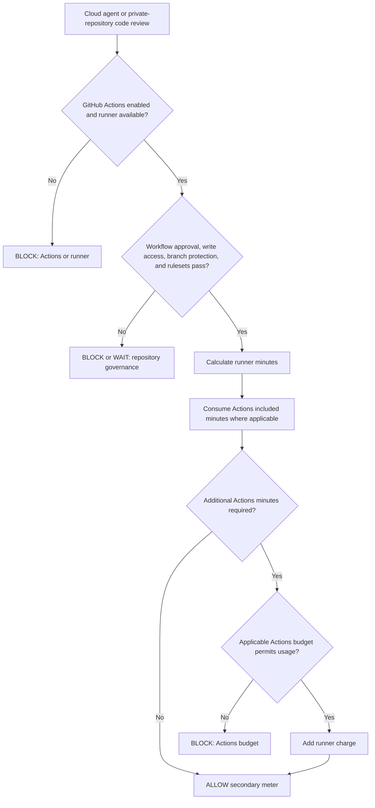

## 7. Simulator component model

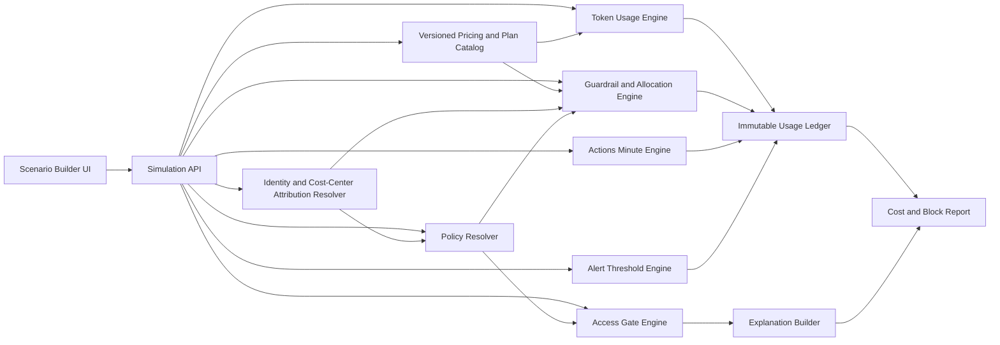

### Minimum scenario inputs

| Group | Inputs |
|---|---|
| Effective context | Simulation timestamp in UTC, billing-cycle start/end, configuration and state version |
| Identity | User, plan, seat state, enterprise, organization memberships, licensing organizations |
| Attribution | Direct cost-center assignment, enterprise-team assignments and creation dates, organization-to-cost-center mapping, cycle-selected billing organization |
| Request | Surface, product, SKU, operation, repository visibility, selected model, auto selection |
| Tokens | Fresh input, cached input, cache write, output, context size |
| Agent loop | Number of calls, tool calls, subagent calls, cache invalidation events |
| ULB controls | Universal, cost-center, and individual limits; configured amount; consumed amount; effective interval |
| Included controls | Enterprise pool entitlement/consumption; license counts; cost-center included cap/consumption; overflow behavior |
| Metered controls | Paid-usage policy; all matching budgets; product/SKU selectors; stop flags; cost-center exclusion; tracking baseline |
| Policy and access | Feature/model policies, client state, network/auth/rate-limit/model availability |
| Session/runtime | CLI soft credit limit, client request cap, subagent depth, elapsed cloud-agent time |
| Secondary meter | Actions enabled state, runner type, runtime, included minutes, Actions budgets, repository governance |

### Minimum result contract

| Field | Purpose |
|---|---|
| `decision` | `allowed`, `blocked`, `soft_stopped`, `waiting`, or `indeterminate` |
| `firstFailingGate` | Stable gate identifier for remediation |
| `attribution` | Billing entity, licensing organization, cost center, resolution rule, confidence |
| `effectiveUlb` | Selected ULB ID/type, limit, consumed, reserved, and remaining |
| `calls[]` | Per-call tokens, rates, multipliers, USD, and credits |
| `allocation` | Enterprise-pool and cost-center-cap draw, metered credits, and USD |
| `appliedGuardrails[]` | Every applicable constraint with phase, enforcement, headroom, and outcome |
| `alerts[]` | Threshold crossings that do not block |
| `actionsUsage` | Minutes, included-minute draw, and additional cost |
| `remaining` | ULB, pool, included-control, every spending budget, and Actions headroom |
| `assumptions[]` | Explicit markers for undocumented behavior |
| `explanation[]` | Ordered human-readable calculation and decision trace |

## 8. Implementation boundaries

1. Store prices and plan allowances as effective-dated data, not constants in calculation code.
2. Represent undocumented values as `unknown`; never convert them to zero.
3. Keep utility-model and unbilled-operation handling outside the credit allocator.
4. Apply policies before cost calculation, but apply budget checks to the calculated request amount.
5. Keep fractional credits internally and expose the unrounded value in the ledger.
6. Make every decision reproducible from the scenario input, catalog version, and ordered trace.
7. Treat promotional prices and dated policy changes as catalog entries with start and end timestamps.
8. Resolve attribution before ULB, included-control, and metered-budget applicability.
9. Evaluate all applicable hard-stop constraints; never collapse them to one selected spending budget.
10. Store configured limits and consumption separately so cycle resets and historical simulation are reproducible.
11. Model enforcement as `hard_stop`, `soft_stop`, `alert_only`, or `observe_only`.
12. Treat alerts as emitted events, not access decisions.
13. Keep AI-credit and Actions budgets as separate meters even when one feature consumes both.
14. Record the selected assumption for undocumented split allocation, rounding, and attribution behavior.

## 9. Historical pre-implementation gap analysis

> This section is a snapshot of the implementation checkpoint from 31 August 2026. It does not describe the current engine. See [docs/MAINTAINABILITY-REVIEW.md](docs/MAINTAINABILITY-REVIEW.md) for current reviewed findings.

| Area | Engine state on 31 August 2026 | Adjustment identified on 31 August 2026 |
|---|---|---|
| ULB identity | Supports three enum values and one remaining-credit value | Add budget ID, user/cost-center target, configured limit, consumed amount, effective dates, cycle, and canonical precedence trace |
| Multiple cost centers | One optional `CostCenterId` | Add direct assignment, enterprise-team and organization fallback resolution with effective dates |
| Cost-center ULB | Representable only as a generic list item | Bind it to the attributed cost center and reject unrelated cost-center ULBs |
| Included-usage cap | Caller supplies remaining credits | Derive cap from effective license assignments; track cap and consumption separately; preserve timing rules |
| Cost-center overflow | Block or paid usage exists | Couple it to attributed cost center and enterprise pool; expose non-retroactive enablement |
| Metered limits | Selects one cost-center, organization, or enterprise budget | Evaluate narrow budget plus enterprise budget concurrently unless exclusion applies |
| Cost-center exclusion | Missing | Add explicit exclusion and remove only the enterprise metered constraint |
| Budget matching | Scope and scope ID only | Add product/SKU/bundle, billing entity, effective interval, tracking baseline, and deleted state |
| Lowest headroom | Single selected budget | Return all applicable constraints and identify the first/lowest hard-stop headroom |
| Organization attribution | One organization ID | Model the cycle-selected billing organization and unresolved multi-org randomness |
| Individual overage | Missing | Add separate individual allowance/additional-usage/payment/channel path |
| Alerts | Missing | Emit 75/90/100 budget crossings; preserve inconsistent ULB alert availability and unverified AI-credit pool alerts as metadata |
| Session limits | Missing | Add CLI soft credits, IDE request count, subagent depth, and cloud-agent duration |
| Actions guardrails | Prices only | Add Actions enabled state, allowance, budget, approval/ruleset state, and exhaustion decision |
| Policy precedence | Caller supplies flat gate results | Add effective enterprise/org/repo/user/client resolution and surface applicability trace |
| Unknown states | Mostly pass or exception | Add `indeterminate` result and structured assumptions/evidence |

Implementation should proceed in this order: **domain contract -> attribution resolver -> ULB resolver -> included allocation -> metered constraint lattice -> alerts -> session/Actions guardrails -> policy resolver -> migration tests**.
