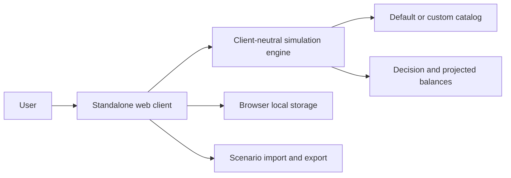
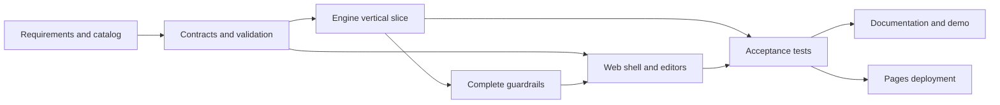

# Copilot Usage Simulator: Hackathon Requirements Specification

**Document status:** Baseline requirements
**Target release:** Current-state parity
**Baseline date:** 2026-09-03
**Reference implementation:** `sujithq/hackathon2026` on `main`
**Audience:** Product owners, hackathon participants, architects, developers, testers, demo owners, and reviewers

## 1. Purpose

This document defines the requirements for building a new Copilot Usage Simulator from an empty repository to functional parity with the current implementation. It is written as an implementation-neutral contract so a hackathon team can choose its internal design while preserving required behavior.

The finished product shall simulate GitHub Copilot AI-credit usage, enterprise guardrails, billing attribution, and related GitHub Actions runner charges. It shall explain whether a modeled request is allowed or stopped, identify the first terminal check, and return projected balances without changing an authoritative external system.

This document is normative for the parity target. The companion `PROJECT-ANALYSIS.md` explains the current design, risks, and longer-term rebuild options. The source implementation and tests remain evidence for details not repeated here.

### 1.1 Normative language

- **Shall:** Mandatory for current-state parity.
- **Should:** Recommended for a successful hackathon but not required for parity.
- **May:** Optional implementation choice.
- **Configured:** Behavior supplied by the active catalog or scenario rather than hard-coded.
- **Terminal:** A result that stops evaluation and prevents later stages from running.

Unless marked otherwise, every numbered requirement in this document is mandatory.

### 1.2 Verification methods

| Code | Method | Meaning |
|---|---|---|
| `T` | Automated test | Prove the behavior with a repeatable unit, component, integration, or end-to-end test. |
| `D` | Demonstration | Exercise the behavior through the finished client. |
| `I` | Inspection | Review source, configuration, generated artifacts, or deployment settings. |
| `A` | Analysis | Verify a calculation, contract, threat, or architecture property. |

### 1.3 Requirement identifiers

Requirements use stable prefixes:

| Prefix | Area |
|---|---|
| `PRD` | Product scope and outcomes |
| `ARC` | Architecture and technology |
| `CFG` | Catalog and configuration |
| `SCN` | Scenario input and validation |
| `SIM` | Simulation pipeline |
| `ATT` | Billing attribution and seats |
| `GAT` | Catalog access gates |
| `RUN` | Runtime guardrails |
| `PRC` | Model pricing and credits |
| `ECO` | Economic guardrails and allocation |
| `ACT` | GitHub Actions behavior |
| `RES` | Result and explainability |
| `SES` | Repeated-session state |
| `WEB` | Web client and user experience |
| `PST` | Browser persistence and files |
| `NFR` | Nonfunctional behavior |
| `SEC` | Security and privacy |
| `ACC` | Accessibility |
| `OPS` | Build, CI, and deployment |
| `DOC` | Documentation and demonstration |
| `TST` | Verification and quality gates |

## 2. Product Definition

### 2.1 Product statement

The product shall answer this modeled question:

> Given a versioned pricing and policy catalog, a usage request, an identity and billing snapshot, and current guardrail balances, what decision does the configured rule sequence produce, why, and what balances would remain?

### 2.2 Product requirements

| ID | Requirement | Verify |
|---|---|---|
| `PRD-001` | The product shall simulate a request without executing a Copilot or GitHub Actions workload. | `T,D` |
| `PRD-002` | The product shall estimate Copilot AI-credit consumption from supplied model-call token counts. | `T,D` |
| `PRD-003` | The product shall estimate applicable GitHub Actions runner charges separately from AI-credit charges. | `T,D` |
| `PRD-004` | The product shall evaluate modeled access, runtime, attribution, included-usage, paid-usage, and spending constraints in a deterministic order. | `T,A` |
| `PRD-005` | The product shall return the first terminal check rather than reporting a later failure as primary. | `T,D` |
| `PRD-006` | The product shall distinguish allowed, blocked, waiting, soft-stopped, partially simulated, and indeterminate outcomes. | `T,D` |
| `PRD-007` | The product shall show the calculation and decision evidence needed to explain an outcome. | `T,D` |
| `PRD-008` | The product shall support sequential repetition of one request with successful consumption carried forward. | `T,D` |
| `PRD-009` | The product shall support reusable scenario and catalog JSON. | `T,D` |
| `PRD-010` | The product shall operate as an offline what-if simulator with no live GitHub dependency. | `I,D` |
| `PRD-011` | The product shall describe its output as modeled rather than authoritative live billing or policy enforcement. | `I,D` |

### 2.3 Users

| User | Required capability |
|---|---|
| Enterprise administrator | Configure and test modeled limits, paid usage, attribution, and budgets. |
| FinOps or billing analyst | Inspect included allocation, metered charges, and projected headroom. |
| Developer or agent operator | Understand whether a modeled task proceeds and why it stops. |
| Platform engineer | Invoke the same client-neutral simulation behavior from another .NET client. |
| Hackathon presenter | Reproduce allowed, blocked, and corrected scenarios in a short browser demonstration. |

### 2.4 Included scope

The parity release shall include:

- a reusable simulation engine;
- an embedded default catalog and custom catalog loading;
- scenario and result contracts;
- model token pricing and multipliers;
- billing attribution and pooled seat entitlement;
- runtime, economic, and Actions guardrails;
- projected state and repeat execution;
- a standalone browser client;
- guided and complete JSON editing;
- browser save/load and scenario import/export;
- automated engine, shared-contract, service, and component tests;
- static deployment support and user documentation.

### 2.5 Excluded scope

The parity release shall not require:

- GitHub API calls or live policy discovery;
- authentication or tenant administration;
- an authoritative billing ledger;
- concurrent credit reservation;
- a database or application backend;
- centralized telemetry;
- historical reporting or forecasting;
- a CLI, server API, desktop application, or IDE extension;
- automatic inference of token counts from natural-language task text.

## 3. System Context



The browser client is the first host of the engine. Additional hosts may be added later, but they shall not be required to complete this parity release.

## 4. Architecture and Technology Requirements

| ID | Requirement | Verify |
|---|---|---|
| `ARC-001` | The solution shall provide a shared module for stable guardrail metadata and documentation links. | `I` |
| `ARC-002` | The solution shall provide a client-neutral engine module containing all reusable simulation decisions and calculations. | `I,T` |
| `ARC-003` | The solution shall provide a standalone Blazor WebAssembly client as the first engine host. | `I,D` |
| `ARC-004` | The engine shall not depend on Web, browser APIs, JavaScript, HTTP, UI frameworks, persistence, or a database. | `I` |
| `ARC-005` | The web client may depend on both the engine and shared metadata modules. | `I` |
| `ARC-006` | Shared metadata shall not depend on the engine or web client. | `I` |
| `ARC-007` | Each production module shall have a matching test project. | `I` |
| `ARC-008` | The solution shall target `net11.0`. | `I` |
| `ARC-009` | The SDK shall be pinned to `11.0.100-preview.7.26381.103` with prerelease enabled and roll-forward disabled. | `I` |
| `ARC-010` | The repository shall support a project-local SDK under `.dotnet`. | `I,D` |
| `ARC-011` | Nullable reference types and implicit usings shall be enabled in every project. | `I` |
| `ARC-012` | The engine shall expose a minimal public interface with its active configuration and a single-scenario simulation operation. | `I,T` |
| `ARC-013` | The engine shall use focused resolvers, evaluators, calculators, and an explicit ordered coordinator rather than client-side domain calculations. | `I,A` |
| `ARC-014` | Client-specific rendering, browser storage, UI state, and workflow orchestration shall remain outside the engine. | `I` |
| `ARC-015` | Production package dependencies shall be limited to the Blazor WebAssembly packages required by the web host unless an added dependency is approved and documented. | `I` |

### 4.1 Required solution layout

The .NET parity implementation shall contain these projects or clearly equivalent modules:

```text
src/
  CopilotUsageSimulator.Common/
  CopilotUsageSimulator.Engine/
  CopilotUsageSimulator.Web/
tests/
  CopilotUsageSimulator.Common.Tests/
  CopilotUsageSimulator.Engine.Tests/
  CopilotUsageSimulator.Web.Tests/
```

The solution shall be addressable through `CopilotUsageSimulator.slnx`.

## 5. Catalog and Configuration Requirements

### 5.1 Catalog behavior

| ID | Requirement | Verify |
|---|---|---|
| `CFG-001` | The engine shall load an embedded default JSON catalog. | `T,I` |
| `CFG-002` | A host shall be able to load a replacement catalog from JSON without changing engine code. | `T,D` |
| `CFG-003` | Catalog construction and loading shall validate the same contract. | `T` |
| `CFG-004` | The catalog shall contain a version, USD-per-credit value, pool-overflow mode, plans, models, operations, access gates, multipliers, Actions runners, and example defaults. | `T,I` |
| `CFG-005` | Catalog IDs shall be nonblank and unique case-insensitively within each entity collection. | `T` |
| `CFG-006` | Catalog references shall resolve case-insensitively to known entities. | `T` |
| `CFG-007` | Empty operation-applicability or model-applicability sets shall mean that the item applies to all values of that dimension. | `T` |
| `CFG-008` | Configuration enums shall serialize as strings and reject numeric or unknown values. | `T` |
| `CFG-009` | USD per credit shall be greater than zero. | `T` |
| `CFG-010` | Multiplier factors and all prices shall be nonnegative. | `T` |
| `CFG-011` | The catalog shall contain at least one plan and one operation. | `T` |
| `CFG-012` | Models, gates, multipliers, and runners may be empty only when no catalog reference requires them. | `T` |
| `CFG-013` | Every plan shall contain at least one allowance period. | `T` |
| `CFG-014` | Every model shall contain at least one price period and every price period shall contain at least one tier. | `T` |
| `CFG-015` | Effective periods for one plan or model shall not overlap. | `T` |
| `CFG-016` | Context tiers in one price period shall not overlap. | `T` |
| `CFG-017` | Effective periods shall use an inclusive start and exclusive end. | `T,A` |
| `CFG-018` | A null effective end shall mean open-ended. | `T` |
| `CFG-019` | Invalid ranges, negative context boundaries, and negative plan allowances shall be rejected. | `T` |
| `CFG-020` | The engine shall fail explicitly when a model has no price period or tier effective for the request. | `T` |
| `CFG-021` | The client shall expose the complete active catalog as editable JSON. | `D` |
| `CFG-022` | Applying invalid catalog JSON shall leave the previous active catalog, engine, scenario, form, and result state unchanged. | `T,D` |
| `CFG-023` | The client shall allow the active catalog to be reset to the embedded default. | `T,D` |

### 5.2 Required default catalog identity

| Property | Required value |
|---|---|
| Version | `2026-09-02` |
| USD per AI credit | `0.01` |
| Pool overflow | `Split` |
| Default product | `github-copilot` |
| Default SKU | `copilot-ai-credits` |
| Preferred operation | `cloud-agent` |
| Preferred plan | `business` |
| Preferred model | `gpt-5.6-luna` |
| Preferred Actions runner | `linux-2-core` |

The complete required catalog content is listed in Appendix A.

## 6. Scenario Contract Requirements

### 6.1 Top-level scenario

| ID | Requirement | Verify |
|---|---|---|
| `SCN-001` | A scenario shall require `OperationId` and `PlanId`. | `T` |
| `SCN-002` | A scenario shall support `ProductId`, defaulting to `github-copilot`. | `T` |
| `SCN-003` | A scenario shall support `SkuId`, defaulting to `copilot-ai-credits`. | `T` |
| `SCN-004` | A scenario shall support an explicit timestamp and shall default to current UTC when omitted programmatically. | `T` |
| `SCN-005` | A scenario shall support `All` and `CostRelatedOnly` check scopes. | `T` |
| `SCN-006` | The contract default check scope shall be `All`; generated web examples shall default to `CostRelatedOnly`. | `T,D` |
| `SCN-007` | A scenario shall support public, private, and internal repository visibility and default to private. | `T` |
| `SCN-008` | A scenario shall support zero or more model-call inputs. | `T` |
| `SCN-009` | A scenario shall support caller-supplied access gate states keyed by gate ID. | `T` |
| `SCN-010` | A scenario shall support optional Actions usage, billing context, attribution, economic guardrails, runtime guardrails, and Actions guardrails. | `T` |
| `SCN-011` | A scenario shall support arbitrary string metadata, including a descriptive task. | `T` |
| `SCN-012` | Billable operations shall require billing context, attribution, and economic guardrails. | `T` |
| `SCN-013` | Unbilled operations shall not require calls or economic context. | `T` |

### 6.2 Model-call input

Each model call shall support:

- model ID;
- context tokens;
- fresh input tokens;
- cached input tokens;
- cache-write tokens;
- output tokens;
- an ordered list of enabled multiplier IDs;
- arbitrary string metadata.

| ID | Requirement | Verify |
|---|---|---|
| `SCN-014` | Token counts shall be whole numbers greater than or equal to zero. | `T` |
| `SCN-015` | Model IDs and multiplier IDs shall be nonblank. | `T` |
| `SCN-016` | One call shall not contain a duplicate multiplier ID, including mixed-case duplicates. | `T` |
| `SCN-017` | Distinct multiplier IDs shall retain caller-supplied order. | `T` |

### 6.3 Billing and guardrail validation

| ID | Requirement | Verify |
|---|---|---|
| `SCN-018` | Billing entity, user, plan, cost-center, organization, runner, budget, ULB, and control IDs shall be nonblank where required. | `T` |
| `SCN-019` | Billing cycles and effective periods shall have a valid start and end. | `T` |
| `SCN-020` | Effective seat periods for the same user shall not overlap, including case-insensitive identity matches. | `T` |
| `SCN-021` | Adjacent seat periods and periods for different users shall be permitted. | `T` |
| `SCN-022` | ULB, included-control, spending-budget, and Actions-budget IDs shall be unique case-insensitively within their collections. | `T` |
| `SCN-023` | Tokens, limits, balances, consumption, usage minutes, and durations shall not be negative unless a projected result explicitly represents overspend. | `T` |
| `SCN-024` | Undefined enum values shall be rejected at the programmatic validation boundary. | `T` |
| `SCN-025` | Invalid scenario contracts shall fail before simulation calculations begin. | `T` |
| `SCN-026` | Scenario validation failures shall expose a stable machine-readable error code. | `T` |
| `SCN-027` | Valid but unknown or ambiguous real-world state shall produce an `Indeterminate` result rather than a contract exception. | `T` |

## 7. Simulation Pipeline Requirements

### 7.1 Mandatory order

| Order | Stage |
|---:|---|
| 1 | Validate scenario and resolve operation and plan. |
| 2 | For billed operations, resolve attribution and selected seat. |
| 3 | In full scope, evaluate runtime hard stops. |
| 4 | In full scope, evaluate Actions access for Actions-capable operations. |
| 5 | In full scope, evaluate configured access gates in ascending sequence. |
| 6 | Return allowed for an unbilled operation. |
| 7 | For a billed operation, require at least one model call for complete simulation. |
| 8 | Price every model call and calculate total credits. |
| 9 | In full scope, evaluate the CLI soft-credit limit. |
| 10 | Calculate applicable Actions usage and cost. |
| 11 | Evaluate economic guardrails and proposed AI-credit allocation. |
| 12 | Evaluate Actions spending budgets after economic approval. |
| 13 | Assemble the final allowed result and projected balances. |

| ID | Requirement | Verify |
|---|---|---|
| `SIM-001` | The engine shall execute stages in the order above. | `T,A` |
| `SIM-002` | A terminal stage shall stop evaluation immediately. | `T` |
| `SIM-003` | A terminal result shall identify the stage-specific first failing check. | `T` |
| `SIM-004` | A later guardrail shall not replace an earlier terminal outcome. | `T` |
| `SIM-005` | Cost-only scope shall skip runtime checks, Actions access checks, catalog access gates, and the CLI soft-credit check. | `T,D` |
| `SIM-006` | Cost-only scope shall still evaluate attribution, selected seats, pricing, economic guardrails, Actions usage, and Actions spending budgets. | `T` |
| `SIM-007` | An unbilled operation shall return `Allowed` after applicable full-scope preflight gates and shall not enter model pricing or economic allocation. | `T` |
| `SIM-008` | A billed operation with no calls shall return `PartiallySimulated`. | `T,D` |
| `SIM-009` | A partially simulated result shall explain that token cost could not be calculated. | `T,D` |
| `SIM-010` | A CLI soft stop shall return after model pricing and before economic allocation or Actions usage is committed. | `T` |
| `SIM-011` | An economic rejection shall occur before the Actions spending-budget stage. | `T` |
| `SIM-012` | An Actions budget rejection shall not commit the otherwise proposed AI-credit allocation. | `T` |
| `SIM-013` | The same valid scenario and configuration shall produce the same result. | `T,A` |

## 8. Billing Attribution and Seat Requirements

### 8.1 Billing context

A billing context shall include:

- billing entity ID;
- billing cycle start and end;
- zero or more effective seat assignments;
- user ID, plan ID, optional cost-center ID, and effective period for each seat.

### 8.2 Attribution input

Attribution input shall include:

- user ID;
- zero or more direct cost-center assignments;
- zero or more team-to-cost-center assignments with team creation time;
- zero or more licensing organization IDs;
- optional billing-cycle-selected licensing organization ID;
- zero or more organization-to-cost-center assignments.

### 8.3 Attribution behavior

| ID | Requirement | Verify |
|---|---|---|
| `ATT-001` | Attribution shall be resolved at the scenario timestamp. | `T` |
| `ATT-002` | A supplied cycle-selected organization shall be one of the user's licensing organizations. | `T` |
| `ATT-003` | One licensing organization shall be selected automatically when it is the only candidate. | `T` |
| `ATT-004` | Multiple licensing organizations without a cycle-selected organization shall return `Indeterminate`. | `T` |
| `ATT-005` | An effective direct user assignment shall have highest cost-center precedence. | `T` |
| `ATT-006` | Multiple effective direct assignments shall return `Indeterminate`. | `T` |
| `ATT-007` | In the absence of a direct assignment, an effective team assignment shall select the cost center. | `T` |
| `ATT-008` | If several effective team assignments exist, the earliest-created team shall win; team ID shall break equal-time ties case-insensitively. | `T` |
| `ATT-009` | In the absence of direct and team assignments, the selected licensing organization's effective assignment shall select the cost center. | `T` |
| `ATT-010` | Multiple effective assignments for the selected organization shall return `Indeterminate`. | `T` |
| `ATT-011` | If no cost center applies, attribution shall resolve to enterprise-only rather than fail. | `T` |
| `ATT-012` | The attribution result shall expose user, optional organization, optional cost center, selected rule, outcome, and explanation. | `T,D` |
| `ATT-013` | ULB, included-control, and spending-budget applicability shall use the same resolved attribution identity. | `T,A` |

### 8.4 Selected seat and entitlement

| ID | Requirement | Verify |
|---|---|---|
| `ATT-014` | A billed request shall resolve exactly one effective seat for the attributed user at the scenario timestamp. | `T` |
| `ATT-015` | A missing effective seat shall return `Indeterminate` with `seat-assignment.missing`. | `T` |
| `ATT-016` | Multiple effective seats shall return `Indeterminate` with `seat-assignment.ambiguous`. | `T` |
| `ATT-017` | A known effective seat plan that conflicts with the scenario plan shall be rejected as an invalid scenario contract. | `T` |
| `ATT-018` | Plan comparison shall be case-insensitive. | `T` |
| `ATT-019` | Pool entitlement shall sum the effective allowance for every effective pooled seat. | `T` |
| `ATT-020` | Non-pooled plans shall contribute zero to enterprise and cost-center pools. | `T` |
| `ATT-021` | An unknown active seat plan or a pooled plan without an effective allowance shall produce unknown seat inventory. | `T` |
| `ATT-022` | Unknown enterprise-pool inventory shall return `Indeterminate` with `pool.seat-inventory`, unless the controlled cost-center inventory is the more specific failure. | `T` |
| `ATT-023` | Unknown controlled cost-center inventory shall return `Indeterminate` with `included-control.seat-inventory`. | `T` |

## 9. Catalog Access Gate Requirements

| ID | Requirement | Verify |
|---|---|---|
| `GAT-001` | The engine shall evaluate access gates in ascending configured sequence. | `T` |
| `GAT-002` | A gate with an operation allow-list shall be evaluated only for listed operations. | `T` |
| `GAT-003` | A nonapplicable gate shall be recorded in the ordered explanation as not applicable. | `T` |
| `GAT-004` | A supplied gate state shall contain pass/fail state and may contain reason and remediation text. | `T` |
| `GAT-005` | An unspecified gate shall use its configured `PassWhenUnspecified` value. | `T` |
| `GAT-006` | A failed gate shall return `Blocked` and its canonical gate ID. | `T` |
| `GAT-007` | A failed gate explanation shall include the supplied reason and nonblank remediation. | `T,D` |
| `GAT-008` | Gate keys shall match case-insensitively. | `T` |
| `GAT-009` | The default catalog shall contain the ordered gate set in Appendix A. | `T,I` |

## 10. Runtime Guardrail Requirements

| ID | Requirement | Verify |
|---|---|---|
| `RUN-001` | Runtime guardrails shall be optional. | `T` |
| `RUN-002` | Runtime guardrails shall be evaluated only for billed operations in full scope. | `T` |
| `RUN-003` | Maximum model calls shall be evaluated before subagent depth and duration. | `T` |
| `RUN-004` | A request shall be blocked when requested call count exceeds maximum calls minus calls already consumed. | `T` |
| `RUN-005` | Maximum subagent depth shall be evaluated after model calls. | `T` |
| `RUN-006` | A request shall be blocked when requested depth exceeds maximum depth. | `T` |
| `RUN-007` | Maximum duration shall be evaluated after depth. | `T` |
| `RUN-008` | A request shall be blocked when elapsed duration plus requested duration exceeds maximum duration. | `T` |
| `RUN-009` | The first failed runtime hard stop shall end simulation before pricing. | `T` |
| `RUN-010` | The CLI credit limit shall be a soft stop evaluated after model pricing. | `T` |
| `RUN-011` | CLI usage shall soft-stop when requested credits exceed the limit minus consumed CLI credits. | `T` |
| `RUN-012` | Every evaluated runtime guardrail shall report its limit, prior consumption, requested amount, projected remainder, enforcement, outcome, and message. | `T,D` |
| `RUN-013` | Runtime guardrails shall use the stable metadata IDs in Appendix A. | `T` |

## 11. Model Pricing and Credit Requirements

| ID | Requirement | Verify |
|---|---|---|
| `PRC-001` | Each call shall resolve a known model case-insensitively. | `T` |
| `PRC-002` | Each call shall select the single price period effective at the scenario timestamp. | `T` |
| `PRC-003` | Each call shall select the single context tier matching its context-token count. | `T` |
| `PRC-004` | Tier minimum context boundaries shall be exclusive and maximum boundaries shall be inclusive. | `T` |
| `PRC-005` | Fresh input USD shall equal fresh input tokens multiplied by the tier input rate divided by one million. | `T,A` |
| `PRC-006` | Cached input USD shall equal cached input tokens multiplied by the cached-input rate divided by one million. | `T,A` |
| `PRC-007` | Cache-write USD shall equal cache-write tokens multiplied by the cache-write rate divided by one million. | `T,A` |
| `PRC-008` | Output USD shall equal output tokens multiplied by the output rate divided by one million. | `T,A` |
| `PRC-009` | Raw USD shall be the sum of all four token-class charges. | `T,A` |
| `PRC-010` | Every enabled multiplier shall resolve from the catalog and apply to the selected operation and model. | `T` |
| `PRC-011` | Nonapplicable multipliers shall fail explicitly rather than be ignored. | `T` |
| `PRC-012` | Applicable multipliers shall compound in the order supplied by the call. | `T,A` |
| `PRC-013` | Adjusted USD shall be raw USD multiplied by all applicable factors. | `T,A` |
| `PRC-014` | Credits shall equal adjusted USD divided by configured USD per credit. | `T,A` |
| `PRC-015` | All token-price, currency, multiplier, and credit arithmetic shall use decimal precision. | `I,T` |
| `PRC-016` | Fractional credits shall be retained in the engine result. | `T` |
| `PRC-017` | The result shall identify call index, model, tier, token-class charges, raw USD, adjusted USD, credits, and applied multipliers. | `T,D` |
| `PRC-018` | The explanation shall contain one ordered pricing entry per call. | `T,D` |
| `PRC-019` | The result shall disclose the fractional-credit rounding assumption. | `T,D` |
| `PRC-020` | The default model and price baseline shall match Appendix A. | `T,I` |

### 11.1 Required formulas

```text
freshInputUsd  = freshInputTokens  * inputUsdPerMillion       / 1,000,000
cachedInputUsd = cachedInputTokens * cachedInputUsdPerMillion / 1,000,000
cacheWriteUsd  = cacheWriteTokens  * cacheWriteUsdPerMillion  / 1,000,000
outputUsd      = outputTokens      * outputUsdPerMillion      / 1,000,000
rawUsd         = freshInputUsd + cachedInputUsd + cacheWriteUsd + outputUsd
adjustedUsd    = rawUsd * multiplier1 * multiplier2 * ...
credits        = adjustedUsd / usdPerCredit
```

## 12. Economic Guardrail Requirements

### 12.1 Billing cycle and pool

| ID | Requirement | Verify |
|---|---|---|
| `ECO-001` | Economic evaluation shall require the timestamp to satisfy `CycleStart <= Timestamp < CycleEnd`. | `T` |
| `ECO-002` | A timestamp outside the billing cycle shall return `Indeterminate` with `billing-cycle.timestamp` when no earlier full-scope check has stopped the request. | `T` |
| `ECO-003` | Enterprise pool remaining shall equal `max(0, entitlement - consumed credits)`. | `T,A` |
| `ECO-004` | Known unchanged pool balance shall be returned on terminal paths where it can be calculated. | `T` |

### 12.2 User-level budgets

| ID | Requirement | Verify |
|---|---|---|
| `ECO-005` | The engine shall support universal, cost-center, and individual ULB records. | `T` |
| `ECO-006` | ULB records shall support ID, kind, target, credit limit, consumed credits, and effective period. | `T` |
| `ECO-007` | Effective ULB precedence shall be individual, then attributed cost center, then universal. | `T` |
| `ECO-008` | A universal ULB shall apply only when its target ID is null. | `T` |
| `ECO-009` | An individual or cost-center ULB shall match its target case-insensitively. | `T` |
| `ECO-010` | Multiple effective ULBs at the selected precedence shall return `Indeterminate` with `ulb.ambiguous`. | `T` |
| `ECO-011` | The selected ULB shall reserve the request's total credits before included/metered allocation. | `T` |
| `ECO-012` | The ULB shall block when requested credits exceed `LimitCredits - ConsumedCredits`. | `T` |
| `ECO-013` | A ULB block shall occur before included-pool or spending-budget allocation. | `T` |
| `ECO-014` | The result shall identify the effective ULB kind, ID, limit, prior consumption, reserved credits, and remaining credits. | `T,D` |

### 12.3 Cost-center included-usage control

| ID | Requirement | Verify |
|---|---|---|
| `ECO-015` | Included-usage controls shall support ID, cost-center ID, consumed credits, overflow behavior, and effective period. | `T` |
| `ECO-016` | A control shall apply only to the attributed cost center and shall match case-insensitively. | `T` |
| `ECO-017` | Multiple effective controls for one attributed cost center shall return `Indeterminate` with `included-control.ambiguous`. | `T` |
| `ECO-018` | The control limit shall be derived from effective pooled seat entitlement assigned to its cost center. | `T,A` |
| `ECO-019` | Control remaining shall equal `max(0, cost-center entitlement - control consumed credits)`. | `T,A` |
| `ECO-020` | Effective included availability shall be the lower of enterprise-pool remaining and control remaining. | `T,A` |
| `ECO-021` | `Block` overflow behavior shall reject a request larger than control remaining before paid-usage evaluation. | `T` |
| `ECO-022` | `PaidUsage` overflow behavior shall permit excess credits to continue to metered evaluation. | `T` |

### 12.4 Pool allocation

| ID | Requirement | Verify |
|---|---|---|
| `ECO-023` | A request fully covered by included availability shall allocate all credits as included. | `T` |
| `ECO-024` | In `Split` mode, an oversized request shall allocate available included credits and meter the remainder. | `T,A` |
| `ECO-025` | In `MeterEntireRequest` mode, an oversized request shall allocate zero included credits and meter the full request. | `T,A` |
| `ECO-026` | Total credits shall equal included credits plus metered credits. | `T,A` |
| `ECO-027` | Metered USD shall equal metered credits multiplied by USD per credit. | `T,A` |
| `ECO-028` | The result shall record the selected included-control ID when one applies. | `T` |
| `ECO-029` | The included-pool check shall be reported as an observe-only applied guardrail after allocation is calculated. | `T,D` |

### 12.5 Paid-usage authorization

| ID | Requirement | Verify |
|---|---|---|
| `ECO-030` | Paid-usage authorization shall support enabled, disabled, and unknown states. | `T` |
| `ECO-031` | Paid-usage authorization shall support product and SKU allow-sets. | `T` |
| `ECO-032` | An empty product or SKU set shall match all values for that dimension. | `T` |
| `ECO-033` | Paid-usage authorization shall be evaluated only when metered credits are required. | `T` |
| `ECO-034` | A product or SKU mismatch shall return `Blocked` with `paid-usage.not-applicable`. | `T,D` |
| `ECO-035` | Unknown authorization shall return `Indeterminate` with `paid-usage.unknown`. | `T` |
| `ECO-036` | Disabled authorization shall return `Blocked` with `paid-usage`. | `T,D` |
| `ECO-037` | Enabled matching authorization shall allow evaluation to continue to spending budgets. | `T` |

### 12.6 Metered spending budgets

| ID | Requirement | Verify |
|---|---|---|
| `ECO-038` | Spending budgets shall support enterprise, organization, and cost-center scopes. | `T` |
| `ECO-039` | Each budget shall support ID, optional scope ID, limit USD, consumed USD, enforcement, product and SKU sets, effective period, and optional tracking start. | `T` |
| `ECO-040` | A budget shall apply only during its effective period and at or after its optional tracking start. | `T` |
| `ECO-041` | A budget shall match product and SKU case-insensitively; empty match sets shall mean all. | `T` |
| `ECO-042` | All matching cost-center budgets shall apply to an attributed cost center. | `T` |
| `ECO-043` | Matching organization budgets shall apply only when no matching cost-center budget applies. | `T` |
| `ECO-044` | Matching enterprise budgets shall apply in addition to cost-center or organization budgets unless the attributed cost center is explicitly excluded. | `T` |
| `ECO-045` | An enterprise exclusion shall match the attributed cost center case-insensitively. | `T` |
| `ECO-046` | Every applicable budget shall be evaluated. | `T` |
| `ECO-047` | Budget headroom shall equal limit USD minus consumed USD. | `T,A` |
| `ECO-048` | A hard-stop budget shall block when metered USD exceeds its headroom. | `T` |
| `ECO-049` | An alert-only budget shall not block and may report negative projected headroom. | `T` |
| `ECO-050` | If multiple hard-stop budgets fail, the budget with the lowest headroom shall be the first failing gate. | `T` |
| `ECO-051` | The result shall expose projected remaining USD for every applicable metered budget by stable budget ID. | `T,D` |
| `ECO-052` | The allocation shall identify an applicable budget ID and all applicable projected budget balances. | `T` |

### 12.7 Threshold alerts

| ID | Requirement | Verify |
|---|---|---|
| `ECO-053` | The engine shall detect crossings of 75%, 90%, and 100% of a spending limit. | `T` |
| `ECO-054` | A threshold event shall contain guardrail ID, threshold, before percentage, and after percentage. | `T` |
| `ECO-055` | One accepted charge may emit every threshold crossed by that charge. | `T` |
| `ECO-056` | Rejected budget charges shall not emit threshold events as accepted consumption. | `T` |

## 13. GitHub Actions Requirements

### 13.1 Operation applicability and pricing

| ID | Requirement | Verify |
|---|---|---|
| `ACT-001` | Operations shall configure Actions metering as `None`, `Always`, or `PrivateRepositories`. | `T` |
| `ACT-002` | `None` shall produce no Actions usage result. | `T` |
| `ACT-003` | `Always` shall meter supplied Actions usage for every repository visibility. | `T` |
| `ACT-004` | `PrivateRepositories` shall meter private and internal repositories but not public repositories. | `T` |
| `ACT-005` | An operation requiring metered Actions usage shall require Actions usage input. | `T` |
| `ACT-006` | Actions usage shall require a known runner, requested minutes, and an included-minutes balance. | `T` |
| `ACT-007` | Included minutes shall be consumed before billable minutes. | `T,A` |
| `ACT-008` | Billable minutes shall equal total minutes minus included minutes. | `T,A` |
| `ACT-009` | Additional Actions USD shall equal billable minutes multiplied by the runner price per minute. | `T,A` |
| `ACT-010` | The result shall expose runner ID, total, included and billable minutes, and additional USD. | `T,D` |

### 13.2 Actions access

| ID | Requirement | Verify |
|---|---|---|
| `ACT-011` | Full-scope Actions access shall be evaluated before catalog access gates. | `T` |
| `ACT-012` | Actions access shall evaluate enabled state, runner availability, workflow approval, and repository rules in that order. | `T` |
| `ACT-013` | Enabled states shall pass; unknown states shall return `Indeterminate`. | `T` |
| `ACT-014` | Disabled Actions, runner, or repository-rule states shall return `Blocked`. | `T` |
| `ACT-015` | Disabled workflow approval shall return `Waiting`. | `T,D` |
| `ACT-016` | The first non-allowed Actions access state shall stop evaluation. | `T` |
| `ACT-017` | An absent Actions guardrail snapshot shall omit Actions access checks rather than synthesize live state. | `T` |

### 13.3 Actions spending budgets

| ID | Requirement | Verify |
|---|---|---|
| `ACT-018` | Actions guardrails shall support total included minutes, consumed included minutes, and zero or more budgets. | `T` |
| `ACT-019` | Each Actions budget shall support ID, USD limit, consumed USD, and hard-stop or alert-only enforcement. | `T` |
| `ACT-020` | Every Actions budget shall evaluate the same additional runner charge. | `T` |
| `ACT-021` | A hard-stop budget shall block when additional Actions USD exceeds headroom. | `T` |
| `ACT-022` | An alert-only Actions budget shall not block. | `T` |
| `ACT-023` | When several hard-stop Actions budgets fail, the lowest-headroom budget shall be primary. | `T` |
| `ACT-024` | Actions budgets shall emit accepted 75%, 90%, and 100% crossings. | `T` |
| `ACT-025` | The result shall expose remaining included minutes and remaining USD for every Actions budget. | `T,D` |
| `ACT-026` | Actions spending budgets shall be evaluated after economic approval. | `T` |

## 14. Result and Explainability Requirements

### 14.1 Result contract

| ID | Requirement | Verify |
|---|---|---|
| `RES-001` | Every simulation shall return exactly one decision or a validated contract exception. | `T` |
| `RES-002` | A terminal result shall expose `FirstFailingGate`; an allowed result shall leave it null. | `T` |
| `RES-003` | The result shall expose itemized call charges. | `T,D` |
| `RES-004` | The result shall expose total, included, and metered credits plus metered USD. | `T,D` |
| `RES-005` | The result shall expose optional Actions usage. | `T,D` |
| `RES-006` | The result shall expose optional attribution and effective ULB. | `T,D` |
| `RES-007` | The result shall expose structured applied guardrails and threshold events. | `T,D` |
| `RES-008` | The result shall expose projected remaining AI and Actions balances. | `T,D` |
| `RES-009` | The result shall expose explicit assumptions. | `T,D` |
| `RES-010` | The result shall expose an ordered explanation trace. | `T,D` |

### 14.2 Applied guardrails

| ID | Requirement | Verify |
|---|---|---|
| `RES-011` | Each applied guardrail shall expose ID, metadata key, category, enforcement, outcome, and message. | `T` |
| `RES-012` | Where meaningful, each applied guardrail shall expose limit, consumed-before, requested, and remaining-after values. | `T,D` |
| `RES-013` | Guardrail presentation metadata shall resolve to a label, category, cost classification, settings anchor, optional official documentation URL, unit, and blocking explanation. | `T,D` |
| `RES-014` | Unknown guardrail metadata shall resolve to a safe generic presentation rather than fail rendering. | `T,D` |
| `RES-015` | Shared metadata keys shall be unique. | `T` |

### 14.3 Explanation trace

| ID | Requirement | Verify |
|---|---|---|
| `RES-016` | Explanation entries shall contain stage, code, and human-readable message. | `T` |
| `RES-017` | Explanation order shall follow actual evaluation order. | `T` |
| `RES-018` | The trace shall include attribution and pricing evidence when those stages are reached. | `T,D` |
| `RES-019` | An allowed result shall end with an explanation that all access and budget checks passed. | `T,D` |
| `RES-020` | Terminal results shall not imply that skipped later checks passed. | `T,D` |

## 15. Repeated Session Requirements

| ID | Requirement | Verify |
|---|---|---|
| `SES-001` | A session shall accept a repeat count from 1 through 1,000 inclusive. | `T,D` |
| `SES-002` | Counts outside that range shall fail with `repeat-count-invalid`. | `T,D` |
| `SES-003` | Each iteration shall simulate the current working scenario. | `T` |
| `SES-004` | A session shall stop after the first result whose decision is not `Allowed`. | `T,D` |
| `SES-005` | Only allowed results shall advance working balances. | `T` |
| `SES-006` | Included pool consumption shall advance by the allowed result's included credits. | `T,A` |
| `SES-007` | The effective ULB shall advance by the allowed result's total credits. | `T,A` |
| `SES-008` | The applied included-control consumption shall advance by included credits. | `T,A` |
| `SES-009` | Every applicable metered budget shall advance by metered USD. | `T,A` |
| `SES-010` | In full scope, runtime model-call consumption shall advance by evaluated result call count. | `T` |
| `SES-011` | In full scope, elapsed duration shall advance by requested duration for an allowed run with evaluated calls. | `T` |
| `SES-012` | In full scope, CLI consumption shall advance by total allocated credits for an allowed run with evaluated calls. | `T` |
| `SES-013` | Cost-only, unbilled, or partially simulated execution shall not incorrectly advance runtime counters. | `T` |
| `SES-014` | Actions included-minute consumption shall advance by included Actions minutes. | `T` |
| `SES-015` | Actions budget consumption shall advance by additional Actions USD. | `T` |
| `SES-016` | A session result shall expose every evaluated run, completed allowed-run count, and the next working scenario. | `T,D` |
| `SES-017` | State updates shall match IDs case-insensitively. | `T` |

## 16. Web Client Requirements

### 16.1 Routes and shell

| ID | Requirement | Verify |
|---|---|---|
| `WEB-001` | The web client shall provide a simulator at `/`. | `T,D` |
| `WEB-002` | The web client shall provide a user guide at `/guide`. | `T,D` |
| `WEB-003` | The web client shall provide a not-found experience for unknown routes. | `T,D` |
| `WEB-004` | The web client shall run the simulation engine in the browser without an application backend. | `I,D` |
| `WEB-005` | The main screen shall present scenario controls and results as one usable workspace. | `D` |

### 16.2 Templates

| ID | Requirement | Verify |
|---|---|---|
| `WEB-006` | The client shall generate standard template buttons from operations with example labels. | `T,D` |
| `WEB-007` | The default catalog shall expose standard templates for chat, cloud agent, and code review. | `T,D` |
| `WEB-008` | The client shall provide cost-blocked templates for ULB exceeded, prohibited included overflow, paid-usage product mismatch, paid usage disabled, AI budget exceeded, and Actions budget exceeded when supported. | `T,D` |
| `WEB-009` | Every generated template shall be valid and immediately simulatable against the active catalog. | `T` |
| `WEB-010` | A blocked template shall stop at its advertised gate. | `T,D` |
| `WEB-011` | Template generation shall derive preferred references from the active catalog and shall not silently coerce an unknown requested operation. | `T` |
| `WEB-012` | Selecting a template shall reset the working scenario to that template's starting balances. | `T,D` |
| `WEB-013` | The selected template shall expose a pressed state and source label. | `T,D` |
| `WEB-014` | Editing a loaded template shall visibly mark it as customized. | `T,D` |

### 16.3 Guided workload controls

| ID | Requirement | Verify |
|---|---|---|
| `WEB-015` | The client shall expose a cost-related-checks-only toggle enabled by default for generated scenarios. | `T,D` |
| `WEB-016` | The client shall expose a descriptive task field that maps to scenario metadata but does not infer usage. | `T,D` |
| `WEB-017` | The client shall expose operation and plan selection from the active catalog. | `T,D` |
| `WEB-018` | The client shall expose repository visibility only when the operation's Actions mode depends on visibility. | `T,D` |
| `WEB-019` | The client shall expose model selection and token inputs only for billed operations. | `T,D` |
| `WEB-020` | The guided call editor shall expose context, fresh input, cached input, cache-write, and output token counts. | `T,D` |
| `WEB-021` | The client shall expose Actions minutes for Actions-capable operations. | `T,D` |
| `WEB-022` | The client shall expose repeat count with a range of 1 through 1,000. | `T,D` |
| `WEB-023` | The client shall display operation-specific context describing billing, Actions, and visibility behavior. | `T,D` |

### 16.4 Guided attribution and economic controls

| ID | Requirement | Verify |
|---|---|---|
| `WEB-024` | The client shall expose guided cost-center and licensing-organization fields for billed operations. | `T,D` |
| `WEB-025` | The client shall expose enterprise pool consumption. | `T,D` |
| `WEB-026` | The client shall expose paid-usage state and comma-separated authorized product and SKU IDs. | `T,D` |
| `WEB-027` | The client shall allow universal, cost-center, and individual ULBs to be enabled or disabled and edited. | `T,D` |
| `WEB-028` | The client shall allow the included-usage control and overflow behavior to be edited. | `T,D` |
| `WEB-029` | The client shall allow cost-center, organization, and enterprise AI spending budgets to be enabled or disabled and edited. | `T,D` |
| `WEB-030` | The client shall allow an Actions spending budget to be enabled or disabled and edited. | `T,D` |
| `WEB-031` | Guided budget controls shall expose limit, consumed amount, and enforcement where supported by the contract. | `T,D` |

### 16.5 Runtime controls

| ID | Requirement | Verify |
|---|---|---|
| `WEB-032` | Runtime controls shall be visible only for billed operations in full scope. | `T,D` |
| `WEB-033` | Runtime controls shall have an enabled state. | `T,D` |
| `WEB-034` | Runtime controls shall expose maximum and consumed model calls. | `T,D` |
| `WEB-035` | Runtime controls shall expose maximum and requested subagent depth. | `T,D` |
| `WEB-036` | Runtime controls shall expose maximum, elapsed, and requested duration in minutes. | `T,D` |
| `WEB-037` | Runtime controls shall expose CLI soft-credit limit and consumed credits. | `T,D` |

### 16.6 Guided-to-JSON synchronization

| ID | Requirement | Verify |
|---|---|---|
| `WEB-038` | The client shall expose the complete scenario as editable JSON. | `T,D` |
| `WEB-039` | The user shall be able to apply guided changes without running simulation. | `T,D` |
| `WEB-040` | The user shall be able to apply guided changes and run simulation in one action. | `T,D` |
| `WEB-041` | The user shall be able to simulate the complete JSON directly. | `T,D` |
| `WEB-042` | The user shall be able to reload guided fields from complete JSON. | `T,D` |
| `WEB-043` | Section adapters shall update only the scenario contracts owned by that guided section. | `T` |
| `WEB-044` | Guided changes shall preserve unselected known advanced records and fields. | `T` |
| `WEB-045` | Adapter application order shall preserve dependencies from workload through attribution, economic, Actions, and runtime sections. | `T` |
| `WEB-046` | Invalid guided or JSON input shall display an error and shall not silently replace valid state. | `T,D` |

### 16.7 Result presentation

| ID | Requirement | Verify |
|---|---|---|
| `WEB-047` | The result panel shall display the decision and first failing check when present. | `T,D` |
| `WEB-048` | A terminal result shall display a "why it stopped" section using shared metadata. | `T,D` |
| `WEB-049` | The blocking section shall display configured limit, prior use, request amount, and projected remaining or shortfall when available. | `T,D` |
| `WEB-050` | The blocking section shall link to and visually highlight the relevant guided setting or complete JSON editor. | `T,D` |
| `WEB-051` | The result panel shall display completed runs, AI credits, included credits, metered credits, metered USD, Actions USD, and pool remaining. | `T,D` |
| `WEB-052` | Repeated simulations shall display an evaluated-run history with run number, decision, credits, metered cost, and stopping gate. | `T,D` |
| `WEB-053` | The result panel shall display attributed user, cost center, organization, and effective ULB. | `T,D` |
| `WEB-054` | Applied guardrails shall be visible by default. | `T,D` |
| `WEB-055` | Users shall be able to filter checks by all, issues, failures, or custom categories. | `T,D` |
| `WEB-056` | Each rendered check shall display ID, category, cost classification where applicable, outcome, message, and available values. | `T,D` |
| `WEB-057` | The result panel shall expose the ordered decision trace and assumptions. | `T,D` |
| `WEB-058` | Successful runs shall advance the working JSON and guided fields; a first-run rejection shall leave balances unchanged. | `T,D` |
| `WEB-059` | Notices shall state how many successful runs advanced or why no balance changed. | `T,D` |

## 17. Persistence and File Requirements

| ID | Requirement | Verify |
|---|---|---|
| `PST-001` | The client shall save scenario JSON, catalog JSON, and display preferences to browser local storage. | `T,D` |
| `PST-002` | Saved state shall use one versioned envelope and one atomic `localStorage.setItem` operation. | `T,I` |
| `PST-003` | The parity storage key shall be `copilot-usage-simulator.state.v1`. | `T,I` |
| `PST-004` | The parity envelope version shall be `1`. | `T,I` |
| `PST-005` | Load shall validate envelope version and completeness. | `T` |
| `PST-006` | Unsupported, malformed, or incomplete saved state shall not partially change live state. | `T,D` |
| `PST-007` | Saved catalog, engine, scenario, guided form, result, and preferences shall be prepared before any live state is committed. | `T` |
| `PST-008` | The client shall report when no saved state exists. | `T,D` |
| `PST-009` | Browser storage failures shall produce a user-visible persistence error. | `T,D` |
| `PST-010` | The client shall import scenario JSON from a browser file. | `T,D` |
| `PST-011` | Scenario imports shall be limited to 2 MiB. | `T,I` |
| `PST-012` | Imported scenarios shall be parsed, validated, mapped, and simulated before replacing live state. | `T` |
| `PST-013` | Failed imports shall preserve the previous catalog, scenario, form, result, and preferences. | `T,D` |
| `PST-014` | The client shall export scenario JSON as `copilot-simulation.json`. | `T,D` |
| `PST-015` | Export shall use a browser download and shall not upload scenario data. | `I,D` |

## 18. Nonfunctional Requirements

### 18.1 Determinism and numerical behavior

| ID | Requirement | Verify |
|---|---|---|
| `NFR-001` | Engine behavior shall depend only on the supplied scenario and active configuration. | `T,A` |
| `NFR-002` | The engine shall not read current time, network state, browser state, or persistent state during `Simulate`. | `I,T` |
| `NFR-003` | Effective-time comparisons shall be timezone-aware `DateTimeOffset` comparisons. | `I,T` |
| `NFR-004` | IDs shall use ordinal case-insensitive comparison where identity matching is specified. | `I,T` |
| `NFR-005` | Ordered collections that affect behavior shall have explicit deterministic ordering. | `T,A` |
| `NFR-006` | Display rounding shall not alter engine allocation or persisted numerical values. | `T` |

### 18.2 Maintainability and extensibility

| ID | Requirement | Verify |
|---|---|---|
| `NFR-007` | New clients shall be able to consume the engine without referencing the web client. | `I,T` |
| `NFR-008` | New catalog entries shall not require engine changes when they use existing schema and behavior. | `T,D` |
| `NFR-009` | Domain behavior shall not be duplicated in the client. | `I` |
| `NFR-010` | Stable IDs, first-failure semantics, explanation order, and projected-balance contracts shall be treated as compatibility surfaces. | `I,T` |
| `NFR-011` | Public behavior changes shall include directly related test and documentation updates. | `I` |
| `NFR-012` | Invalid input shall not be hidden with broad catches, silent defaults, or unchecked casts. | `I,T` |

### 18.3 Performance and capacity

| ID | Requirement | Verify |
|---|---|---|
| `NFR-013` | A normal interactive scenario shall execute entirely in memory. | `I,D` |
| `NFR-014` | The web client shall support up to 1,000 sequential requested runs and stop early on a non-allowed result. | `T,D` |
| `NFR-015` | The parity release shall not require a background worker, queue, or database. | `I` |

### 18.4 Compatibility and portability

| ID | Requirement | Verify |
|---|---|---|
| `NFR-016` | Scenario and catalog JSON property matching shall be case-insensitive. | `T` |
| `NFR-017` | JSON output shall use indented camel-case enum strings compatible with current examples. | `T` |
| `NFR-018` | Static web assets shall support hosting below a repository path on GitHub Pages. | `I,D` |
| `NFR-019` | The engine shall remain usable from a CLI, API, desktop app, test harness, notebook, or background service without web dependencies, even though those hosts are out of parity scope. | `I,A` |

## 19. Security and Privacy Requirements

| ID | Requirement | Verify |
|---|---|---|
| `SEC-001` | The parity application shall require no credentials, secrets, or privileged tokens. | `I,D` |
| `SEC-002` | Scenario and catalog data shall remain in the browser unless the user explicitly exports a file. | `I,D` |
| `SEC-003` | The application shall not transmit simulation data to an application server. | `I,D` |
| `SEC-004` | Imported JSON shall be treated as data and deserialized into validated typed contracts. | `I,T` |
| `SEC-005` | Imported file size shall be bounded as specified by `PST-011`. | `T` |
| `SEC-006` | External documentation links opened in a new context shall use safe relationship attributes. | `T,I` |
| `SEC-007` | No secret or confidential credential shall be embedded in catalog, source, or static web assets. | `I` |
| `SEC-008` | The user guide shall disclose that browser storage and exported files may contain organization, user, cost-center, seat, and budget identifiers. | `I` |
| `SEC-009` | GitHub Pages build jobs shall use read-only repository contents permission; deployment credentials shall be limited to the deployment job. | `I` |
| `SEC-010` | Third-party workflow actions shall be pinned to immutable commit SHAs. | `I` |

## 20. Accessibility and Responsive Requirements

| ID | Requirement | Verify |
|---|---|---|
| `ACC-001` | Every guided form control shall have an associated visible or accessible label. | `T,D` |
| `ACC-002` | Template selection shall expose `aria-pressed`. | `T` |
| `ACC-003` | Scenario source and status messages shall use an appropriate live region. | `T,D` |
| `ACC-004` | Check filtering shall have an accessible name. | `T` |
| `ACC-005` | Native semantic controls and section elements shall be used where practical. | `I,T` |
| `ACC-006` | Documentation links shall expose their topic through accessible text or labeling. | `T,D` |
| `ACC-007` | Error and success states shall not rely only on color. | `I,D` |
| `ACC-008` | The main two-panel workspace shall adapt to a usable single-column layout on narrow screens. | `I,D` |
| `ACC-009` | Text, controls, metrics, and result values shall not overlap at supported desktop and mobile widths. | `D` |
| `ACC-010` | Keyboard users shall be able to reach and operate every action and form control in the primary workflow. | `D` |

## 21. Build, CI, and Deployment Requirements

| ID | Requirement | Verify |
|---|---|---|
| `OPS-001` | The repository shall restore, test, build, and run with the pinned local SDK. | `D,I` |
| `OPS-002` | Release configuration shall be used for final test and build validation. | `I` |
| `OPS-003` | The full solution test suite shall run before static web publication. | `I` |
| `OPS-004` | The Release build shall complete without warnings or errors introduced by the implementation. | `T` |
| `OPS-005` | The web client shall publish as standalone static WebAssembly assets. | `I,D` |
| `OPS-006` | A GitHub Actions workflow shall deploy the static client to GitHub Pages on pushes to `main`. | `I,D` |
| `OPS-007` | The workflow shall also support manual dispatch. | `I` |
| `OPS-008` | Deployment shall stop if restore, tests, build, or publish fails. | `I,T` |
| `OPS-009` | Repository whitespace validation shall pass with `git diff --check`. | `T` |
| `OPS-010` | Build and generated output directories shall not be treated as authored source. | `I` |

### 21.1 Required local commands

```powershell
.\.dotnet\dotnet.exe restore CopilotUsageSimulator.slnx
.\.dotnet\dotnet.exe test CopilotUsageSimulator.slnx --configuration Release
.\.dotnet\dotnet.exe build CopilotUsageSimulator.slnx --configuration Release --no-restore
.\.dotnet\dotnet.exe run --project src\CopilotUsageSimulator.Web\CopilotUsageSimulator.Web.csproj
git diff --check
```

## 22. Documentation and Demo Requirements

| ID | Requirement | Verify |
|---|---|---|
| `DOC-001` | The repository shall provide a README describing purpose, projects, engine usage, configuration, integration boundaries, web usage, deployment, and validation. | `I` |
| `DOC-002` | The repository shall provide a user guide for the browser workflow, decisions, fields, repeated runs, and JSON editing. | `I,D` |
| `DOC-003` | The user guide shall be reachable from the application. | `T,D` |
| `DOC-004` | The repository shall retain domain flow and policy-analysis documents as supporting research. | `I` |
| `DOC-005` | Historical gap analyses shall be labeled as historical when superseded by implementation. | `I` |
| `DOC-006` | The repository shall maintain a findings ledger with review scope, findings, status, and validation baseline. | `I` |
| `DOC-007` | The repository shall provide a maximum two-minute hackathon jury script. | `I,D` |
| `DOC-008` | The demo shall show one allowed cloud-agent scenario. | `D` |
| `DOC-009` | The demo shall show a ULB-blocked scenario and its first failing check. | `D` |
| `DOC-010` | The demo shall correct a paid-usage product mismatch and rerun the scenario. | `D` |
| `DOC-011` | The demo shall explain that the reusable engine is deterministic and client-neutral. | `D` |
| `DOC-012` | User-facing cost controls shall link to relevant official GitHub documentation where metadata provides a URL. | `T,D` |

## 23. Test and Verification Requirements

### 23.1 Test stack

| ID | Requirement | Verify |
|---|---|---|
| `TST-001` | Engine and shared contract tests shall use xUnit or an equivalent deterministic unit-test framework. | `I` |
| `TST-002` | Blazor component tests shall use bUnit or equivalent component-level rendering tests. | `I` |
| `TST-003` | Test projects shall be included in the solution and run through one solution-level command. | `I,T` |
| `TST-004` | Release tests shall be deterministic and shall not require GitHub, a browser server, a database, or credentials. | `T,I` |
| `TST-005` | The current behavioral corpus, recorded as 218 passing Release tests at baseline, shall be retained or replaced by equivalent coverage. | `T,A` |

### 23.2 Mandatory coverage

| ID | Requirement | Verify |
|---|---|---|
| `TST-006` | Tests shall cover every catalog access gate as a blocking endpoint. | `T` |
| `TST-007` | Tests shall cover every runtime and Actions terminal endpoint. | `T` |
| `TST-008` | Tests shall cover every attribution ambiguity endpoint. | `T` |
| `TST-009` | Tests shall cover selected-plan match, conflict, missing seat, ambiguous seat, unknown plan, and missing allowance. | `T` |
| `TST-010` | Tests shall cover all token classes, multiplier order, fractional credits, and long-context tiers. | `T` |
| `TST-011` | Tests shall cover ULB precedence and same-precedence ambiguity. | `T` |
| `TST-012` | Tests shall cover both pool-overflow modes. | `T` |
| `TST-013` | Tests shall cover included-control block and paid overflow. | `T` |
| `TST-014` | Tests shall cover paid usage enabled, disabled, unknown, and product/SKU mismatch. | `T` |
| `TST-015` | Tests shall cover budget scope hierarchy, exclusions, enforcement, lowest headroom, and tracking boundaries. | `T` |
| `TST-016` | Tests shall cover accepted threshold crossings and rejected-charge alert suppression. | `T` |
| `TST-017` | Tests shall cover Actions visibility metering, included minutes, runner price, access, waiting, and budget ordering. | `T` |
| `TST-018` | Tests shall cover allowed, blocked, waiting, soft-stopped, partial, and indeterminate results. | `T` |
| `TST-019` | Tests shall cover repeated state advancement, case-insensitive IDs, early stopping, and nonmutation on terminal outcomes. | `T` |
| `TST-020` | Tests shall cover null collections, blank IDs, duplicate IDs, duplicate multipliers, negative values, invalid enums, invalid periods, and overlapping seats. | `T` |
| `TST-021` | Tests shall cover custom catalog application and reset. | `T` |
| `TST-022` | Tests shall cover guided editor ownership, order, and preservation of advanced known fields. | `T` |
| `TST-023` | Tests shall cover browser persistence envelope round trips and failure atomicity. | `T` |
| `TST-024` | Tests shall cover malformed imports and saved-state restoration without partial state replacement. | `T` |
| `TST-025` | Tests shall cover conditional UI visibility, result metrics, filtering, setting highlights, and official documentation links. | `T` |

## 24. Acceptance Scenarios

The parity release shall pass all scenarios below.

| ID | Scenario | Expected result |
|---|---|---|
| `AC-01` | Run an unbilled operation without calls or economic context. | `Allowed`; no AI or runtime economic consumption. |
| `AC-02` | Run a billed request that fits the selected ULB, included control, and pool. | `Allowed`; all credits included. |
| `AC-03` | Exhaust part of a split pool and request more than remains. | `Allowed`; remaining pool included and excess metered. |
| `AC-04` | Use meter-entire mode with insufficient included availability. | `Allowed` when paid controls pass; entire request metered. |
| `AC-05` | Configure universal, cost-center, and individual ULBs for one user. | Individual ULB is selected. |
| `AC-06` | Exhaust the selected individual ULB. | `Blocked`; individual ULB ID is first. |
| `AC-07` | Configure two effective ULBs at the selected precedence. | `Indeterminate`; `ulb.ambiguous`. |
| `AC-08` | Exhaust a blocking cost-center included control. | `Blocked` before paid-usage evaluation. |
| `AC-09` | Require metering with an unmatched paid-usage product. | `Blocked`; `paid-usage.not-applicable`. |
| `AC-10` | Require metering with unknown paid authorization. | `Indeterminate`; `paid-usage.unknown`. |
| `AC-11` | Require metering with disabled paid authorization. | `Blocked`; `paid-usage`. |
| `AC-12` | Fail both cost-center and enterprise AI budgets. | Lowest-headroom applicable budget is first. |
| `AC-13` | Simulate before, at, and after a budget tracking start. | Omitted before; applicable at and after. |
| `AC-14` | Exclude the attributed cost center from enterprise budget. | Matching enterprise budget is not applied. |
| `AC-15` | Exceed model-call, depth, and duration limits together. | Model-call limit is first. |
| `AC-16` | Exceed the CLI soft-credit limit. | `SoftStopped`; no economic allocation is committed. |
| `AC-17` | Disable workflow approval for an Actions operation. | `Waiting`; workflow approval ID is first. |
| `AC-18` | Run private and public code-review scenarios. | Private meters Actions; public does not. |
| `AC-19` | Fail AI and Actions spending budgets together. | AI budget is first; no allocation is committed. |
| `AC-20` | Price a call exactly at and above a long-context boundary. | Correct default and long-context tiers are selected. |
| `AC-21` | Simulate after the final price period for a model. | Explicit `pricing-not-effective` failure. |
| `AC-22` | Supply a selected plan different from the effective user seat. | Invalid scenario contract. |
| `AC-23` | Supply multiple licensing organizations without cycle selection. | `Indeterminate`; attribution is unresolved. |
| `AC-24` | Repeat an allowed request until a balance is exhausted. | Allowed balances advance once per run; session stops at first rejection. |
| `AC-25` | Run the same scenario in cost-only and full scope. | Cost results remain; operational checks appear only in full scope. |
| `AC-26` | Load a malformed scenario or catalog. | Error shown; previous complete client state retained. |
| `AC-27` | Save and reload browser state. | Scenario, catalog, preferences, guided form, and results restore consistently. |
| `AC-28` | Run the same fixed scenario and catalog repeatedly. | Equivalent results every time. |
| `AC-29` | Load every standard and blocked template. | Each is valid; blocked variants stop at advertised checks. |
| `AC-30` | Complete the documented two-minute demo. | Allowed, blocked, corrected, and explainability story fits the timebox. |

## 25. Hackathon Delivery Plan

### 25.1 Entry criteria

Before implementation starts, the team shall agree on:

1. this requirements baseline;
2. current-state parity as the release boundary;
3. the fixed default catalog in Appendix A;
4. three primary demo scenarios: allowed cloud agent, ULB block, and paid-usage mismatch correction;
5. repository ownership and merge rules;
6. team roles and workstream leads;
7. a known working .NET 11 local SDK and package restore path.

### 25.2 Recommended workstreams

| Workstream | Responsibilities | Primary outputs |
|---|---|---|
| Product and domain | Resolve requirement questions, protect sequencing, validate terminology and assumptions. | Approved requirements, decisions, demo data. |
| Engine and contracts | Build catalog, contracts, validators, resolvers, evaluators, coordinator, and sessions. | Common and Engine projects with tests. |
| Web experience | Build guided editing, JSON workflows, results, persistence, and responsive presentation. | Web project with bUnit tests. |
| Quality and CI | Build acceptance fixtures, test gates, package checks, and Pages workflow. | Green Release pipeline. |
| Documentation and demo | Build README, guide, analysis, jury script, and presentation flow. | Complete project handoff and rehearsed demo. |

### 25.3 Dependency order



### 25.4 Recommended implementation sequence

1. Create the solution, project references, local SDK configuration, and test projects.
2. Implement catalog contracts, JSON loading, validation, and the exact default catalog.
3. Implement scenario/result contracts and scenario validation.
4. Implement one allowed billed vertical slice from attribution through pricing and included allocation.
5. Implement terminal decisions in required pipeline order.
6. Add complete economic, runtime, and Actions behavior.
7. Add repeat execution and projected state advancement.
8. Build the browser shell, templates, guided adapters, and JSON editors.
9. Build result explainability, filters, highlights, documentation links, and persistence.
10. Complete parity acceptance scenarios and the full Release quality gate.
11. Publish to GitHub Pages and rehearse the jury script from a clean browser profile.

### 25.5 Suggested milestone gates

| Gate | Exit condition |
|---|---|
| M1 - Foundation | Six projects restore and build; default catalog loads and validates. |
| M2 - Engine slice | One fixed billed scenario produces an allowed deterministic result with itemized pricing. |
| M3 - Domain parity | All terminal endpoints, allocations, balances, and repeat semantics pass engine tests. |
| M4 - Client parity | Templates, guided fields, JSON workflows, results, and browser persistence pass component/service tests. |
| M5 - Release | Full Release suite and build pass, Pages artifact deploys, and two-minute demo is rehearsed. |

## 26. Definition of Done

The hackathon implementation reaches current-state parity only when all conditions below are true.

### 26.1 Product

- All `PRD` requirements are met.
- All 30 acceptance scenarios pass.
- Standard and blocked templates tell the intended demo story.
- The product visibly distinguishes modeled output from live authority.

### 26.2 Architecture and behavior

- Domain calculations exist only in the client-neutral engine.
- The mandatory pipeline order is covered by automated tests.
- Stable IDs and every terminal decision are preserved.
- Effective dates and case-insensitive identity rules are consistent across stages.
- Blocked and unresolved results do not mutate session state.

### 26.3 Client

- Guided controls and complete JSON workflows are functional.
- Scenario, catalog, preferences, and results restore transactionally.
- The result explains the first terminal check and projected values.
- Primary workflows operate at desktop and mobile widths and by keyboard.

### 26.4 Quality

- The complete Release test suite passes.
- The Release build succeeds without new warnings or errors.
- `git diff --check` passes.
- No unresolved requirement-blocking defects remain.
- Direct and transitive dependency vulnerability checks report no unresolved vulnerable packages.

### 26.5 Delivery

- Static WebAssembly assets deploy successfully to GitHub Pages.
- README, user guide, project analysis, findings ledger, and demo script are current.
- The demo completes within two minutes from a clean browser profile.
- The repository contains no required local secret or uncommitted generated dependency.

## 27. Assumptions Carried by the Parity Target

These statements are requirements for reproducing current behavior, but they remain domain assumptions until independently confirmed:

| ID | Assumption |
|---|---|
| `ASM-01` | One AI credit is represented by the catalog's `0.01` USD conversion value. |
| `ASM-02` | Fractional credits are retained because authoritative billing rounding is not encoded. |
| `ASM-03` | Reasoning-token usage is included in supplied output-token counts unless a future contract separates it. |
| `ASM-04` | Multiple configured multipliers compound in caller-supplied order. |
| `ASM-05` | The supplied seat, assignment, budget, usage, and access snapshots are accurate. |
| `ASM-06` | Unspecified default catalog access gates pass because `PassWhenUnspecified` is true. |
| `ASM-07` | A simulation result is a projection and does not reserve or commit authoritative balances. |
| `ASM-08` | The catalog's plans, prices, dates, and runner rates are demonstration data until their provenance is approved. |

A future product may change an assumption only through a documented catalog or behavioral version change with migration and regression tests.

## Appendix A. Required Default Catalog Baseline

### A.1 Plans

All plan allowance periods begin at `2026-06-01T00:00:00Z` and are open-ended unless stated otherwise.

| Plan ID | Included credits per user | Pooled |
|---|---:|---|
| `free` | Unknown (`null`) | No |
| `student` | Unknown (`null`) | No |
| `pro` | 1,500 | No |
| `pro-plus` | 7,000 | No |
| `max` | 20,000 | No |
| `business` | 1,900 | Yes |
| `enterprise` | 3,900 | Yes |

### A.2 Operations

| Operation ID | AI billed | Actions mode | Example label |
|---|---|---|---|
| `code-completion` | No | `None` | None |
| `next-edit-suggestion` | No | `None` | None |
| `utility-model` | No | `None` | None |
| `chat` | Yes | `None` | Chat |
| `ide-agent` | Yes | `None` | None |
| `cli` | Yes | `None` | None |
| `copilot-app` | Yes | `None` | None |
| `cloud-agent` | Yes | `Always` | Cloud agent |
| `code-review` | Yes | `PrivateRepositories` | Code review |
| `spaces` | Yes | `None` | None |
| `third-party-agent` | Yes | `None` | None |

Required example tasks:

| Operation | Task |
|---|---|
| `chat` | Explain the architecture and propose a safe implementation plan. |
| `cloud-agent` | Implement the requested feature, run checks, and report the result. |
| `code-review` | Review the repository and explain the highest-risk defects. |

### A.3 Ordered catalog access gates

All default gates use `PassWhenUnspecified: true`.

| Sequence | Gate ID | Applicability |
|---:|---|---|
| 10 | `license-seat` | All operations |
| 20 | `policy` | All operations |
| 30 | `content-exclusion` | All operations |
| 40 | `public-code` | All operations |
| 50 | `responsible-ai` | All operations |
| 60 | `technical-limits` | All operations |
| 70 | `network` | All operations |
| 80 | `authentication` | All operations |
| 90 | `rate-limit` | All operations |
| 100 | `model-availability` | All operations |
| 110 | `cloud-agent-runtime` | `cloud-agent` only |

### A.4 Multipliers

| Multiplier ID | Factor | Operation applicability | Model applicability |
|---|---:|---|---|
| `auto-model-selection` | 0.90 | `chat`, `cli`, `copilot-app`, `cloud-agent` | All models |
| `data-residency-fedramp` | 1.10 | All operations | All models |

### A.5 Actions runners

| Runner ID | USD per minute |
|---|---:|
| `linux-1-core` | 0.002 |
| `linux-2-core` | 0.006 |
| `linux-arm64` | 0.005 |
| `windows-2-core` | 0.010 |
| `windows-arm64` | 0.010 |
| `macos-3-4-core` | 0.062 |
| `self-hosted` | 0.000 |

### A.6 Models and prices

Rates are USD per one million tokens. `CW` means cache-write. A blank `CW` value is zero. Unless stated otherwise, each period starts at `2026-06-01T00:00:00Z` and is open-ended.

| Model | Tier and context | Input | Cached | CW | Output | Effective end |
|---|---|---:|---:|---:|---:|---|
| `gpt-5-mini` | `default` | 0.25 | 0.025 | 0 | 2.00 | Open |
| `gpt-5.3-codex` | `default` | 1.75 | 0.175 | 0 | 14.00 | Open |
| `gpt-5.4` | `default`, context <= 272,000 | 2.50 | 0.25 | 0 | 15.00 | Open |
| `gpt-5.4` | `long-context`, context > 272,000 | 5.00 | 0.50 | 0 | 22.50 | Open |
| `gpt-5.4-mini` | `default` | 0.75 | 0.075 | 0 | 4.50 | Open |
| `gpt-5.4-nano` | `default` | 0.20 | 0.02 | 0 | 1.25 | Open |
| `gpt-5.5` | `default`, context <= 272,000 | 5.00 | 0.50 | 0 | 30.00 | Open |
| `gpt-5.5` | `long-context`, context > 272,000 | 10.00 | 1.00 | 0 | 45.00 | Open |
| `gpt-5.6-luna` | `default`, context <= 200,000 | 0.20 | 0.02 | 0.25 | 1.20 | Open |
| `gpt-5.6-luna` | `long-context`, context > 200,000 | 0.40 | 0.04 | 0.50 | 1.80 | Open |
| `gpt-5.6-sol` | `promotional-default`, context <= 272,000 | 2.00 | 0.20 | 2.50 | 10.00 | 2026-09-04 |
| `gpt-5.6-sol` | `promotional-long-context`, context > 272,000 | 4.00 | 0.40 | 5.00 | 15.00 | 2026-09-04 |
| `gpt-5.6-terra` | `default`, context <= 272,000 | 2.00 | 0.20 | 2.50 | 12.00 | Open |
| `gpt-5.6-terra` | `long-context`, context > 272,000 | 4.00 | 0.40 | 5.00 | 18.00 | Open |
| `claude-haiku-4.5` | `default` | 1.00 | 0.10 | 1.25 | 5.00 | Open |
| `claude-sonnet-4` | `default` | 3.00 | 0.30 | 3.75 | 15.00 | Open |
| `claude-sonnet-4.5` | `default` | 3.00 | 0.30 | 3.75 | 15.00 | Open |
| `claude-sonnet-4.6` | `default` | 3.00 | 0.30 | 3.75 | 15.00 | Open |
| `claude-sonnet-5` | `default` | 2.00 | 0.20 | 2.50 | 10.00 | Open |
| `claude-opus-4.5` | `default` | 5.00 | 0.50 | 6.25 | 25.00 | Open |
| `claude-opus-4.6` | `default` | 5.00 | 0.50 | 6.25 | 25.00 | Open |
| `claude-opus-4.7` | `default` | 5.00 | 0.50 | 6.25 | 25.00 | Open |
| `claude-opus-4.8` | `default` | 5.00 | 0.50 | 6.25 | 25.00 | Open |
| `claude-opus-5` | `default` | 5.00 | 0.50 | 6.25 | 25.00 | Open |
| `claude-opus-4.8-fast` | `default` | 10.00 | 1.00 | 12.50 | 50.00 | Open |
| `claude-fable-5` | `default` | 10.00 | 1.00 | 12.50 | 50.00 | Open |
| `gemini-3.1-pro-preview` | `default`, context <= 200,000 | 2.00 | 0.20 | 0 | 12.00 | Open |
| `gemini-3.1-pro-preview` | `long-context`, context > 200,000 | 4.00 | 0.40 | 0 | 18.00 | Open |
| `gemini-3.5-flash` | `default` | 1.50 | 0.15 | 0 | 9.00 | Open |
| `gemini-3.6-flash` | `promotional` | 0.75 | 0.075 | 0 | 3.75 | 2027-01-01 |
| `gemini-3.7-flash` | `promotional` | 0.75 | 0.075 | 0 | 3.75 | 2027-01-01 |
| `grok-4.5` | `default`, context <= 200,000 | 2.00 | 0.50 | 0 | 6.00 | Open |
| `grok-4.5` | `long-context`, context > 200,000 | 4.00 | 1.00 | 0 | 12.00 | Open |
| `grok-4.6` | `default`, context <= 200,000 | 2.00 | 0.50 | 0 | 6.00 | Open |
| `grok-4.6` | `long-context`, context > 200,000 | 4.00 | 1.00 | 0 | 12.00 | Open |
| `mai-code-1-flash` | `default` | 0.75 | 0.075 | 0 | 4.50 | Open |
| `mai-code-1.1-flash` | `default` | 0.20 | 0.02 | 0 | 1.20 | Open |
| `kimi-k2.7-code` | `default` | 0.95 | 0.19 | 0 | 4.00 | Open |
| `kimi-k3` | `default` | 3.00 | 0.30 | 0 | 15.00 | Open |
| `raptor-mini` | `default` | 0.25 | 0.025 | 0 | 2.00 | Open |

### A.7 Stable guardrail metadata keys

| Area | Required keys |
|---|---|
| Runtime | `runtime.model-calls`, `runtime.subagent-depth`, `runtime.duration`, `runtime.cli-soft-credits` |
| ULB | `ulb.universal`, `ulb.cost-center`, `ulb.individual` |
| Included usage | `included-usage-control`, `included-pool` |
| Paid usage | `paid-usage` |
| AI budgets | `metered-budget.cost-center`, `metered-budget.organization`, `metered-budget.enterprise` |
| Actions | `actions-budget`, `actions.enabled`, `actions.runner-available`, `actions.workflow-approval`, `actions.repository-rules` |

## Appendix B. Required Decision Values

| Value | Meaning |
|---|---|
| `Allowed` | Every reached check passed and projected usage may be applied by the host. |
| `Blocked` | A hard-stop guardrail rejected the request. |
| `PartiallySimulated` | The request was valid but lacked model calls needed for complete billing. |
| `SoftStopped` | A modeled soft limit stopped continuation after pricing. |
| `Waiting` | An external approval condition is not yet satisfied. |
| `Indeterminate` | Required state is unknown or ambiguous and shall not be treated as allowed. |

## Appendix C. Required Handoff Artifacts

At hackathon completion, the repository shall contain:

1. source for shared metadata, engine, and web client;
2. all three test projects;
3. pinned SDK and solution files;
4. embedded default catalog;
5. GitHub Pages workflow;
6. README;
7. user guide;
8. project analysis and rebuild blueprint;
9. this requirements specification;
10. maintainability findings ledger;
11. domain flow and policy research documents;
12. two-minute demo script;
13. no required credentials or machine-specific configuration.

## Appendix D. Requirements Traceability Summary

| Requirement area | Primary implementation surface | Primary verification surface |
|---|---|---|
| Product and architecture | Solution projects and references | Solution inspection and full build |
| Catalog | Engine configuration contracts, loader, validator, default JSON | Configuration validation tests |
| Scenario contract | Scenario records and validator | Scenario validator tests |
| Pipeline | Simulation engine coordinator | Simulation and blocking-endpoint tests |
| Attribution and seats | Attribution resolver and balance calculator | Guardrail and effective-date tests |
| Runtime | Runtime evaluator | Blocking and guardrail tests |
| Pricing | Model-call calculator and catalog tiers | Simulation engine tests |
| Economic behavior | Applicability resolver, balance calculator, economic evaluator | Guardrail, resolver, and session tests |
| Actions | Actions evaluator and runner calculation | Guardrail and blocking tests |
| Results | Result contracts, pipeline context, shared metadata | Engine, Common, and component tests |
| Sessions | Session runner | Session runner tests |
| Web workflows | Home page model, editor adapters, pages, shared components | Home, service, and shared-component tests |
| Persistence | Browser persistence service and JavaScript download helper | Web service tests |
| Deployment | Static web project and Pages workflow | Release pipeline and deployment smoke test |
| Documentation | Root and `docs` Markdown | Review and demo rehearsal |