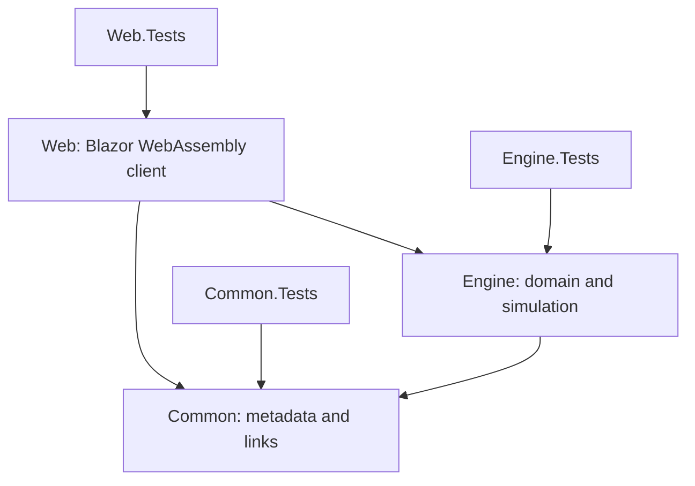
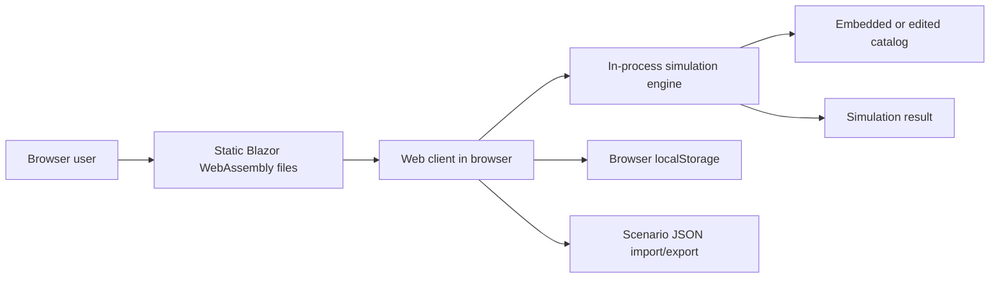
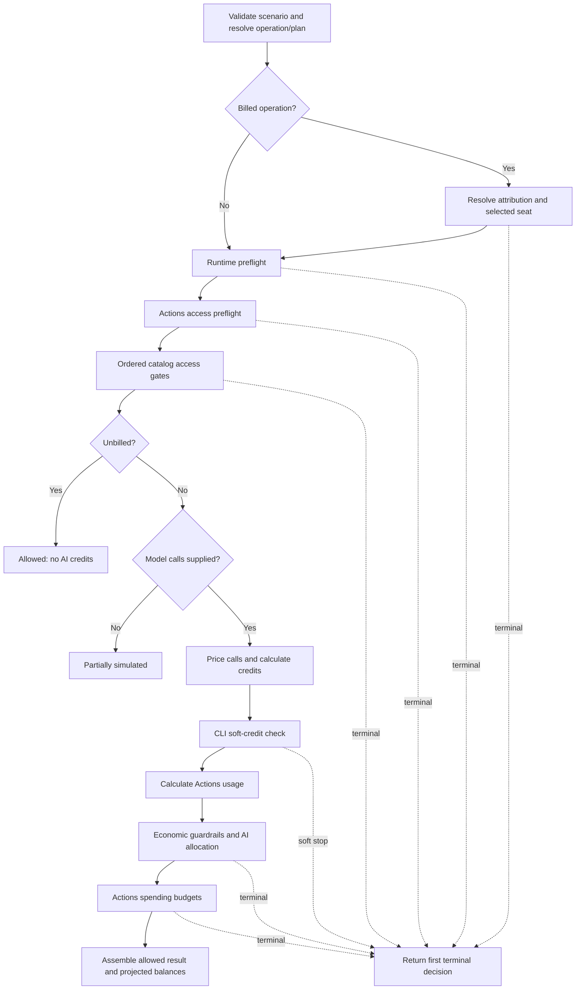
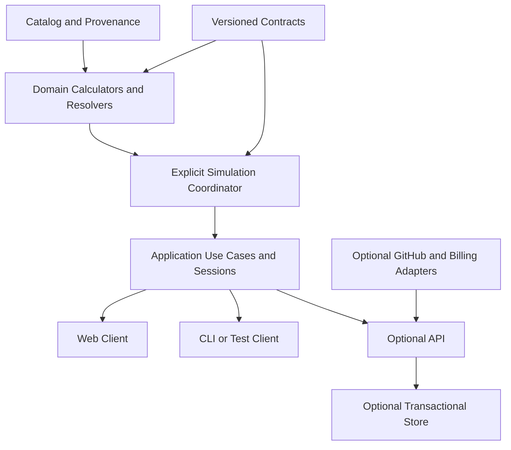

# Copilot Usage Simulator: Project Analysis and Rebuild Blueprint

**Analysis date:** 2026-09-03  
**Repository:** `sujithq/hackathon2026`  
**Branch analyzed:** `main`  
**Audience:** Hackathon participants, product owners, architects, developers, testers, and future maintainers  
**Purpose:** Provide one implementation-grounded reference for extending the current prototype or rebuilding it without losing its domain semantics.

## 1. How to Use This Document

This document combines four views of the project:

1. **Current system:** What the repository implements today.
2. **Behavioral contract:** Rules and ordering that a compatible rebuild must preserve.
3. **Assessment:** Strengths, limitations, risks, and missing capabilities.
4. **Delivery blueprint:** A practical scope, architecture, backlog, and acceptance criteria for a hackathon or full rebuild.

Statements use these labels where the distinction matters:

- **Verified:** Confirmed in the current source, configuration, tests, or workflow.
- **Assumption:** Deliberately modeled because authoritative behavior is incomplete or unavailable.
- **Recommendation:** A proposed direction for future work, not current behavior.
- **Open decision:** A product or architecture choice that must be made by the team.

This is an engineering baseline, not a claim that the embedded pricing and policy data is an authoritative representation of GitHub billing. The catalog must be independently validated before the simulator is used for financial or enforcement decisions.

## 2. Executive Summary

The Copilot Usage Simulator is a deterministic, offline simulator for GitHub Copilot AI-credit usage, enterprise cost guardrails, billing attribution, and related GitHub Actions runner charges. A caller supplies a complete scenario snapshot. The engine validates it, evaluates checks in a fixed order, prices model calls, allocates included and metered usage, and returns an explainable result with projected balances.

The solution is organized around a strong architectural boundary:

- `CopilotUsageSimulator.Engine` owns reusable simulation behavior.
- `CopilotUsageSimulator.Common` owns stable presentation metadata and documentation links.
- `CopilotUsageSimulator.Web` is a standalone Blazor WebAssembly client that runs the engine in the browser.
- Matching xUnit and bUnit projects test contracts, calculations, state transitions, services, and components.

The project is best described as a well-tested prototype and reference implementation. It is not a live GitHub integration, a billing ledger, a policy administration system, or a concurrency-safe usage reservation service.

### Current posture

| Area | Assessment |
|---|---|
| Domain engine | Strong. Explicit orchestration, decimal arithmetic, effective dating, validation, and first-failing-check behavior are implemented. |
| Explainability | Strong for runtime, economic, and Actions guardrails. Catalog access gates have a less structured trace. |
| Client separation | Strong. The engine has no browser, persistence, web, or presentation dependency. |
| Configuration | Strong schema validation, but catalog provenance and refresh governance are not encoded. |
| Reproducibility | Strong when the scenario and catalog are fixed; weaker when timestamps default to current time or only scenario JSON is exported. |
| Automated tests | Broad unit/component coverage. No real-browser, accessibility, performance, or live-integration suite. |
| Operations | Simple static hosting. No backend, authentication, centralized persistence, telemetry, or multi-user controls. |
| Production readiness | Suitable for demonstrations and what-if analysis. Additional provenance, versioning, security, integration, and operational work is required for production decisions. |

### Most valuable assets to preserve

1. The client-neutral engine boundary.
2. The explicit, ordered evaluation pipeline.
3. Stable failure and metadata identifiers.
4. Inclusive-start, exclusive-end effective dating.
5. Deterministic decimal calculations.
6. Attribution and guardrail applicability based on the same selected identity.
7. Projected balances without implicit persistence.
8. Test coverage for terminal and malformed-input paths.

### Highest-priority rebuild concerns

1. Establish authoritative catalog ownership, sources, effective dates, and update cadence.
2. Clarify whether the product is a what-if simulator or a live preflight decision service.
3. Version scenario, catalog, and result envelopes independently.
4. Preserve current behavior with executable golden scenarios before replacing the engine.
5. Decide whether browser-only storage is acceptable for organization and budget identifiers.
6. Add browser-level accessibility and end-to-end tests.
7. Add live-state adapters and concurrency controls only if the product will reserve or commit usage.

## 3. Product Definition

### 3.1 Problem statement

Copilot usage can be affected by several independent concerns:

- feature and access policies;
- model token pricing and context tiers;
- included AI-credit allowances and shared pools;
- individual, cost-center, organization, and enterprise controls;
- paid-usage authorization;
- GitHub Actions access, included minutes, and spending budgets;
- runtime limits for agentic workloads.

The project turns those concerns into a reproducible question:

> Given this catalog, identity snapshot, usage request, and current balances, what decision would the modeled rules produce, why, and what balances would remain?

### 3.2 Product outcomes

The current product supports these outcomes:

- estimate AI-credit and Actions cost before execution;
- identify the first modeled condition that prevents execution;
- compare included and metered allocation;
- test changes to budgets, attribution, paid usage, and runtime controls;
- repeat a request and carry successful consumption forward;
- import, export, and save scenarios for demonstrations and analysis;
- reuse the same engine from clients other than the web app.

### 3.3 Personas

| Persona | Need | Current support |
|---|---|---|
| Enterprise administrator | Test guardrails and understand why a request is blocked. | Guided controls, JSON editor, blocked templates, structured outcomes. |
| FinOps or billing analyst | Estimate pool draw, metered cost, and budget headroom. | Decimal pricing, allocation, projected balances, repeated runs. |
| Developer or agent operator | Check whether a modeled workload can proceed. | Operation templates, runtime checks, first failure, remediation text for supplied access gates. |
| Platform engineer | Embed the simulator in another client. | UI-independent engine interface and immutable input/output records. |
| Hackathon judge or stakeholder | Understand value quickly. | Browser-only demo, standard and blocked scenarios, two-minute demo script. |

### 3.4 Primary user journeys

#### Journey A: Estimate an allowed workload

1. Select a task template.
2. Choose an operation, plan, model, token counts, and optional Actions usage.
3. Supply billing, attribution, and guardrail snapshots.
4. Simulate one or more sequential runs.
5. Inspect the decision, credit allocation, costs, checks, assumptions, and remaining balances.

#### Journey B: Diagnose a blocked workload

1. Load or construct a blocked scenario.
2. Run the simulation.
3. Read `FirstFailingGate` and the structured blocking values.
4. Follow the settings anchor or documentation link.
5. Change the relevant input and simulate again.

#### Journey C: Test a catalog change

1. Open the pricing and policy catalog editor.
2. Modify plans, models, operations, gates, multipliers, or runners.
3. Apply the catalog, which validates and constructs a new engine.
4. Run templates against the new catalog.
5. Save the browser state or separately retain the catalog and scenario.

#### Journey D: Reproduce cumulative consumption

1. Set a repeat count from 1 to 1,000.
2. Run the scenario through `SimulationSessionRunner`.
3. Advance balances after each allowed run.
4. Stop at the first non-allowed result.
5. Use the returned next scenario as the new working state.

### 3.5 Explicit non-goals of the current implementation

- It does not call GitHub APIs.
- It does not discover seats, policies, cost centers, budgets, tokens, or runner usage.
- It does not authenticate users or authorize administrators.
- It does not persist an authoritative billing ledger.
- It does not reserve balances atomically across concurrent callers.
- It does not execute Copilot or Actions workloads.
- It does not guarantee that modeled policy or pricing matches the live service.
- It does not provide a server-side API, CLI, database, or multi-tenant control plane.

## 4. Domain Language

| Term | Meaning in this project |
|---|---|
| AI credit | Internal usage unit derived from adjusted model cost divided by `UsdPerCredit`. |
| Included credits | Credits allocated from effective pooled seat entitlement. |
| Metered credits | Credits requiring paid usage after included availability is insufficient. |
| User-level budget (ULB) | A credit limit selected by individual, cost-center, then universal precedence. |
| Included-usage control | Cost-center control whose limit is derived from effective pooled seats in that cost center. |
| Paid usage | Product- and SKU-scoped authorization to incur metered AI-credit cost. |
| Spending budget | Cost-center, organization, or enterprise USD constraint for metered credits. |
| Billing context | Billing entity, cycle, and effective seat assignments supplied by the caller. |
| Attribution | Selection of the user, licensing organization, and cost center used by downstream calculations. |
| Access gate | Ordered caller-supplied state such as license, policy, network, or model availability. |
| Runtime guardrail | Model-call, depth, duration, or CLI-credit limit for an agentic request. |
| Actions meter | Included and billable runner minutes, priced separately from AI credits. |
| First failing gate | Stable identifier for the earliest terminal check in the defined pipeline. |
| Indeterminate | Required state is unknown, missing in a non-contract sense, or ambiguous. It is not treated as allowed. |
| Partially simulated | The operation is billable but no model-call input was supplied, so cost cannot be completed. |
| Projected balance | Remaining value calculated for the result; the engine does not persist it. |

## 5. Repository and Technology Baseline

### 5.1 Solution composition

The solution contains six SDK-style .NET projects:

| Project | Target | Responsibility |
|---|---|---|
| `src/CopilotUsageSimulator.Common` | `net11.0` | Shared metadata, categories, settings anchors, stable keys, and official documentation links. |
| `src/CopilotUsageSimulator.Engine` | `net11.0` | Configuration, validation, domain contracts, pricing, attribution, guardrails, state projection, and orchestration. |
| `src/CopilotUsageSimulator.Web` | `net11.0` | Standalone Blazor WebAssembly host, guided editor, JSON editors, browser persistence, and result presentation. |
| `tests/CopilotUsageSimulator.Common.Tests` | `net11.0` | Shared metadata contract tests. |
| `tests/CopilotUsageSimulator.Engine.Tests` | `net11.0` | Engine contract, calculation, sequencing, validation, and session tests. |
| `tests/CopilotUsageSimulator.Web.Tests` | `net11.0` | bUnit component, service, editor, persistence, and workflow tests. |

### 5.2 Toolchain

- SDK: `11.0.100-preview.7.26381.103`.
- SDK selection is pinned by `global.json` with roll-forward disabled.
- A repository-local SDK exists under `.dotnet`.
- Nullable reference types and implicit usings are enabled.
- The solution uses `CopilotUsageSimulator.slnx`.
- The engine embeds `Configuration/default-catalog.json` as an assembly resource.

### 5.3 Direct package dependencies

Production dependencies are intentionally small:

| Project | Package | Version | Purpose |
|---|---|---:|---|
| Web | `Microsoft.AspNetCore.Components.WebAssembly` | `11.0.0-preview.7.26381.103` | Browser-hosted Blazor runtime. |
| Web | `Microsoft.AspNetCore.Components.Gateway` | `11.0.0-preview.7.26381.103` | Build/runtime support, marked private. |

Test projects use `xunit`, `xunit.runner.visualstudio`, `Microsoft.NET.Test.Sdk`, and `coverlet.collector`; web tests also use `bunit` and `AngleSharp`.

### 5.4 Project dependency graph



The engine does not depend on Web, browser APIs, storage, HTTP, a database, or a presentation framework. This is the most important current architecture constraint.

### 5.5 Runtime and deployment topology



There is no application server after the static files are downloaded. The current deployment workflow publishes the WebAssembly output to GitHub Pages and gates deployment on the Release test suite. Deployment credentials are scoped to the deployment job rather than the build job.

### 5.6 Source ownership map

| Area | Primary files | Owner responsibility |
|---|---|---|
| Shared metadata | `Common/Guardrails/GuardrailMetadata.cs` | Labels, categories, settings anchors, cost classification, units, blocking text. |
| Documentation links | `Common/Documentation/GitHubDocumentationLinks.cs` | Stable official GitHub URLs used by clients. |
| Public engine | `Engine/ICopilotUsageSimulationEngine.cs`, `CopilotUsageSimulationEngine.cs` | Validate and execute one scenario. |
| Catalog | `Engine/Configuration/*`, `default-catalog.json` | Versioned plans, prices, operations, gates, multipliers, runners, and validation. |
| Attribution and balances | `Engine/Guardrails/BillingAndAttribution.cs`, `EconomicBalanceCalculator.cs` | Effective identity, seat entitlement, balance projection, and advancement. |
| Guardrails | `Engine/Guardrails/*Evaluator.cs`, `EconomicGuardrailApplicabilityResolver.cs` | Runtime, economic, and Actions decisions. |
| Contracts | `Engine/Simulation/SimulationScenario.cs`, `SimulationResult.cs` | Serializable engine input and output. |
| Repetition | `Engine/Simulation/SimulationSessionRunner.cs` | Sequential simulation and successful state advancement. |
| Page orchestration | `Web/Services/HomePageModel.cs` | Active engine/catalog, templates, import/load transactions, simulation, UI notices. |
| Guided editing | `Web/Services/*EditorAdapter.cs`, `ScenarioEditorState.cs` | Map selected typed fields to and from the full scenario. |
| Persistence | `Web/Services/BrowserScenarioPersistence.cs` | Versioned browser envelope, 2 MiB import cap, and scenario download. |
| Main experience | `Web/Pages/Home.razor`, `Web/Shared/*` | Editor, templates, decision, metrics, guardrail list, and trace. |

Generated `bin`, `obj`, local `.dotnet`, and `apm_modules` content is not part of the product design and should be excluded from rebuild analysis.

## 6. Current System Architecture

### 6.1 Architectural style

The implementation is a deterministic domain library with a client-specific application layer:

1. **Configuration layer:** Loads and validates policy and pricing data.
2. **Domain contracts:** Describe scenario snapshots and results.
3. **Decision services:** Resolve attribution, applicability, balances, runtime limits, economic guardrails, and Actions rules.
4. **Explicit coordinator:** Calls those services in a fixed order.
5. **Client orchestration:** Builds scenarios, manages a working session, and handles persistence.
6. **Presentation:** Renders controls and structured results.

This is closer to a modular monolith than a rules engine. Ordering remains visible in `CopilotUsageSimulationEngine`, which is beneficial because first-failure semantics are a core behavior.

### 6.2 Public engine surface

```csharp
public interface ICopilotUsageSimulationEngine
{
    EngineConfiguration Configuration { get; }
    SimulationResult Simulate(SimulationScenario scenario);
}
```

The public interface is deliberately small. All state needed for a deterministic result is provided through `SimulationScenario`; all projected state is returned through `SimulationResult`.

### 6.3 Input contract

`SimulationScenario` contains:

- operation, plan, product, and SKU identifiers;
- simulation timestamp and check scope;
- repository visibility;
- zero or more model calls;
- caller-supplied access gate states;
- optional Actions usage;
- billing cycle and effective seat assignments;
- attribution candidates;
- economic, runtime, and Actions guardrail snapshots;
- arbitrary string metadata.

Billable operations require billing, attribution, and economic snapshots. An unbilled operation can complete without model calls or economic context.

### 6.4 Output contract

`SimulationResult` returns:

- `Decision`;
- `FirstFailingGate`;
- itemized model-call charges;
- included and metered credit allocation;
- Actions usage and additional cost;
- resolved attribution;
- effective ULB;
- structured applied guardrails;
- threshold events;
- projected remaining balances;
- explicit assumptions;
- ordered human-readable explanation entries.

The decision enum is:

- `Allowed`
- `Blocked`
- `PartiallySimulated`
- `SoftStopped`
- `Waiting`
- `Indeterminate`

These values are behaviorally distinct and must not be collapsed into a boolean in a rebuild.

## 7. End-to-End Evaluation Pipeline

### 7.1 Ordered stages



The verified sequence is:

1. Reject a null or invalid scenario contract.
2. Resolve operation and plan identifiers from the active catalog.
3. For billed operations, require economic context.
4. Resolve attribution at the scenario timestamp.
5. Reconcile the selected plan with the attributed user's effective seat.
6. Detect missing, ambiguous, conflicting, or unknown seat inventory.
7. Unless cost-only mode is selected, evaluate runtime hard stops.
8. Unless cost-only mode is selected, evaluate Actions access for Actions operations.
9. Unless cost-only mode is selected, evaluate catalog access gates by sequence.
10. Return `Allowed` immediately for an unbilled operation.
11. Return `PartiallySimulated` when a billed operation has no model calls.
12. Price each model call and sum credits.
13. Unless cost-only mode is selected, evaluate the CLI soft-credit limit.
14. Calculate applicable Actions runner usage.
15. Evaluate economic guardrails and proposed AI-credit allocation.
16. Evaluate Actions spending budgets after economic approval.
17. Commit only projected values to the allowed result and return it.

### 7.2 Cost-only mode

`SimulationCheckScope.CostRelatedOnly` skips:

- runtime preflight;
- Actions access state checks;
- catalog access gates;
- CLI soft-credit evaluation.

It does not skip attribution, seat consistency, pricing, economic guardrails, Actions usage calculation, or Actions spending budgets. This makes cost-only mode a focused financial simulation, not a bypass of financial constraints.

### 7.3 Terminal behavior

| Condition | Decision | Later stages evaluated? | Session balances advance? |
|---|---|---|---|
| Invalid contract | Exception with stable code | No | No |
| Ambiguous attribution or seat state | `Indeterminate` | No | No |
| Runtime hard stop | `Blocked` | No | No |
| Workflow approval disabled | `Waiting` | No | No |
| Access gate failure | `Blocked` | No | No |
| Unbilled operation | `Allowed` | No pricing/economic stages | No model/runtime economic consumption |
| Missing calls on billed operation | `PartiallySimulated` | No | No |
| CLI soft-credit excess | `SoftStopped` | No economic or Actions pricing result is committed | No |
| Economic guardrail failure | `Blocked` or `Indeterminate` | No Actions budget stage | No |
| Actions budget failure | `Blocked` | AI allocation is not committed | No |
| All checks pass | `Allowed` | Yes | Yes |

Only allowed session results advance the working scenario. This gives repeated simulations transaction-like behavior: a request is projected as a whole or not applied.

## 8. Pricing and Allocation Model

### 8.1 Per-call model price

For each call, the engine selects:

1. the model by case-insensitive ID;
2. the price period effective at the scenario timestamp;
3. the context tier matching the supplied context-token count.

The raw price is:

```text
rawUsd = freshInputTokens * inputRate / 1,000,000
       + cachedInputTokens * cachedInputRate / 1,000,000
       + cacheWriteTokens * cacheWriteRate / 1,000,000
       + outputTokens * outputRate / 1,000,000
```

Enabled multipliers are validated for operation/model applicability and applied in the order supplied:

```text
adjustedUsd = rawUsd * multiplier1 * multiplier2 * ...
credits = adjustedUsd / usdPerCredit
```

All monetary and credit calculations use `decimal`.

### 8.2 Verified assumptions

- Fractional AI credits are retained because billing rounding is documented as unknown by the project research.
- Reasoning tokens are expected to be included in output tokens unless a future contract distinguishes them.
- Multiplier interaction is configuration-driven and sequential.
- Empty applicability sets mean "all".
- IDs are generally compared case-insensitively.

These assumptions should be represented as versioned policy data or explicit result provenance in a production rebuild.

### 8.3 Included pool

The enterprise included pool is derived from all effective pooled seat assignments:

```text
poolEntitlement = sum(effective pooled seat allowance at timestamp)
poolRemaining = max(0, poolEntitlement - enterprisePoolConsumedCredits)
```

Non-pooled plans do not add credits to the enterprise pool. Missing catalog plans or missing effective pooled allowances produce unknown seat inventory rather than silently contributing zero.

### 8.4 Cost-center included control

When an effective included-usage control matches the attributed cost center, its cap is derived from pooled seats assigned to that cost center. The control can:

- block when the full request exceeds its remaining derived entitlement; or
- permit overflow into paid usage.

Included availability becomes the lower of enterprise-pool remaining and cost-center-control remaining.

### 8.5 Pool overflow

Two catalog behaviors exist:

- `Split`: consume available included credits and meter the remainder.
- `MeterEntireRequest`: when included availability cannot cover the request, meter the entire request.

If included availability covers the full request, both modes allocate it as included.

### 8.6 Paid usage

Metered credits require paid-usage authorization that matches both product and SKU scopes. Outcomes are:

- unmatched product or SKU: `Blocked` with `paid-usage.not-applicable`;
- unknown authorization: `Indeterminate` with `paid-usage.unknown`;
- disabled authorization: `Blocked` with `paid-usage`;
- enabled authorization: proceed to spending budgets.

### 8.7 Metered budgets

Budget applicability uses effective date, optional tracking baseline, product, SKU, scope, and selected attribution.

The hierarchy is precise:

1. Include all matching cost-center budgets for the attributed cost center.
2. If no cost-center budget matched, include matching organization budgets.
3. Include matching enterprise budgets unless the attributed cost center is explicitly excluded.

Therefore, enterprise constraints can apply in addition to cost-center constraints. A cost-center match suppresses organization budgets but not enterprise budgets.

Every applicable budget is evaluated. If more than one hard-stop budget fails, the result reports the budget with the lowest headroom. Alert-only budgets may project negative headroom without blocking.

Threshold events are generated when accepted usage crosses 75%, 90%, or 100%. Rejected charges do not emit those threshold events as accepted consumption.

## 9. Identity and Attribution

### 9.1 Attribution precedence

The resolver uses one effective timestamp and the following order:

1. Direct user-to-cost-center assignment.
2. Effective enterprise team assignment, choosing the earliest-created team and then team ID for deterministic ordering.
3. Effective assignment for the selected or sole licensing organization.
4. Enterprise-only attribution when no cost center applies.

### 9.2 Ambiguity handling

The result is `Indeterminate` when:

- a cycle-selected organization is not in the user's licensing organizations;
- multiple licensing organizations exist without a selected one;
- multiple direct cost-center assignments are effective;
- a selected organization has multiple effective cost-center assignments.

The engine does not guess. The same resolved user, organization, and cost center then control selected-seat validation, ULB selection, included controls, and budget applicability.

### 9.3 Effective-time convention

Effective periods consistently use:

```text
effectiveFrom <= timestamp < effectiveTo
```

The start is inclusive and the end is exclusive. A null end means open-ended. This convention applies to catalog periods, seats, assignments, ULBs, controls, and budgets and must be preserved in all clients and persistence layers.

## 10. Guardrail Inventory

### 10.1 Catalog access gates

The default catalog defines these ordered gates:

| Sequence | ID | Meaning supplied by host |
|---:|---|---|
| 10 | `license-seat` | Required license or seat state. |
| 20 | `policy` | Feature and organization policy state. |
| 30 | `content-exclusion` | Requested content availability. |
| 40 | `public-code` | Public-code policy result. |
| 50 | `responsible-ai` | Safety or responsible-AI result. |
| 60 | `technical-limits` | External technical-limit result. |
| 70 | `network` | Endpoint, proxy, firewall, or certificate result. |
| 80 | `authentication` | Authentication and SSO result. |
| 90 | `rate-limit` | External rate-limit state. |
| 100 | `model-availability` | Plan, policy, or regional model availability. |
| 110 | `cloud-agent-runtime` | Cloud-agent-only runtime availability. |

The engine does not calculate these states. A host supplies `Passed`, `Reason`, and optional `Remediation`. In the default catalog, unspecified gates pass. A strict host can provide a catalog where `PassWhenUnspecified` is false.

Current limitation: these catalog gate evaluations are written to the explanation trace, not represented as full `AppliedGuardrail` records. Their presentation metadata also falls back to a generic descriptor unless a shared metadata entry exists. A rebuild should normalize all checks into one structured trace while preserving the existing failure IDs.

### 10.2 Runtime guardrails

| Metadata ID | Enforcement | Check |
|---|---|---|
| `runtime.model-calls` | Hard stop | Requested calls must fit remaining cumulative call count. |
| `runtime.subagent-depth` | Hard stop | Requested depth must not exceed maximum depth. |
| `runtime.duration` | Hard stop | Elapsed plus requested duration must fit the maximum. |
| `runtime.cli-soft-credits` | Soft stop | Existing plus requested credits must fit the CLI session limit. |

Runtime checks are skipped in cost-only mode. The first three run before pricing. The credit check runs after pricing and returns immediately when soft-stopped.

### 10.3 ULB selection

ULB precedence is:

1. `Individual`
2. `CostCenter`
3. `Universal`

The enum order and descending resolver iteration implement this precedence. Multiple effective ULBs at the selected precedence produce `ulb.ambiguous`. The ULB reserves total requested credits before included/metered allocation and consumes total credits after an allowed run.

### 10.4 Actions access and budgets

Actions access is evaluated in this order:

1. `actions.enabled`
2. `actions.runner-available`
3. `actions.workflow-approval`
4. `actions.repository-rules`

Disabled workflow approval returns `Waiting`; other disabled states return `Blocked`; unknown state returns `Indeterminate`.

Actions usage is metered according to the operation:

- `None`: no Actions calculation.
- `Always`: calculate regardless of repository visibility.
- `PrivateRepositories`: calculate for private and internal repositories, not public repositories.

Included runner minutes are consumed first. Remaining minutes are multiplied by the runner's USD-per-minute price. Every Actions budget is evaluated, with the lowest-headroom failing hard-stop budget reported. Actions spending is checked only after economic approval.

## 11. Configuration and Stable Contracts

### 11.1 Default catalog snapshot

The embedded catalog is versioned `2026-09-02` and currently contains:

- 7 plans;
- 11 operations;
- 11 catalog access gates;
- 2 multipliers;
- 7 Actions runners;
- 32 models with one or more effective-dated price tiers.

The catalog also defines default example references, `UsdPerCredit`, and pool-overflow behavior.

The data includes finite promotional periods. For example, one model period ends on 2026-09-04 and two others end on 2027-01-01. Missing future pricing intentionally causes `pricing-not-effective`; the engine does not extrapolate.

### 11.2 Configuration validation

Engine construction validates, among other rules:

- positive USD-per-credit value;
- defined enum values;
- non-null collections and items;
- at least one plan and operation;
- nonblank, case-insensitively unique stable IDs;
- valid example references;
- valid gate and multiplier references;
- nonnegative multiplier and runner prices;
- nonempty, non-overlapping plan allowance periods;
- nonempty, non-overlapping model price periods;
- nonempty, unique context tiers;
- valid context boundaries and nonnegative token prices.

Configuration enums are serialized as strings and numeric values are rejected by the catalog loader.

### 11.3 Scenario validation

The scenario validator protects the engine boundary with rules for:

- required operation, plan, product, SKU, model, runner, user, billing entity, and scoped IDs;
- nonnegative tokens, balances, limits, durations, and usage;
- valid billing and effective date ranges;
- timestamp and identity consistency where required;
- case-insensitive duplicate guardrail IDs;
- duplicate enabled multipliers within a call;
- overlapping seat periods for the same user;
- invalid enum values and malformed runtime/Actions values.

Contract failures throw `SimulationException` with a stable code. Unknown or ambiguous real-world state returns a result decision instead of being treated as malformed input.

### 11.4 Stable identifiers

A compatible rebuild must retain or explicitly map:

- operation IDs;
- plan and model IDs used in persisted scenarios;
- access gate IDs;
- runtime and Actions metadata keys;
- user-supplied budget and control IDs;
- result decision names;
- exception codes;
- explanation codes where consumers rely on them;
- catalog version and effective timestamps.

`GuardrailMetadataCatalog` is the presentation contract for runtime, economic, and Actions checks. It maps keys to labels, categories, settings anchors, official documentation URLs, units, and blocking explanations.

### 11.5 Versioning gap

The catalog has a free-form version and browser persistence has envelope version `1`, but scenario and result JSON do not have independent schema versions. Unknown JSON fields are not retained as an extension bag by typed round trips. Export downloads only scenario JSON, not the active catalog or result.

For durable sharing, a rebuild should introduce an explicit envelope such as:

```json
{
  "schemaVersion": "1.0",
  "catalogVersion": "2026-09-02",
  "engineVersion": "1.0.0",
  "scenario": {},
  "result": null,
  "provenance": {}
}
```

The exact shape is an open design choice. The requirement is that a saved simulation identify the contract, catalog, engine behavior, and source assumptions needed to reproduce it.

## 12. Session and State Semantics

`SimulationSessionRunner` accepts an engine, a starting scenario, and a repeat count from 1 through 1,000.

For each iteration it:

1. simulates the current scenario;
2. records the result;
3. stops on any decision other than `Allowed`;
4. advances only balances represented by the allowed result;
5. uses the advanced scenario for the next iteration.

Allowed state advancement is scoped:

- enterprise pool consumed increases by included credits;
- the effective ULB increases by total credits;
- the applied included control increases by included credits;
- each applicable metered budget increases by metered USD;
- full-scope runtime counters advance only when calls were evaluated;
- Actions included minutes and applicable budget usage advance when Actions usage exists.

The runner is an in-memory projection utility. It is not a transaction manager. Any live service must perform authoritative reads and compare-and-swap or transactional writes outside the engine after a request is accepted.

## 13. Web Client Analysis

### 13.1 Routes and composition

The standalone client has:

- `/`: simulator workspace;
- `/guide`: user guide;
- fallback not-found page;
- a shared main layout and static CSS/JavaScript assets.

The root registers one default catalog and engine, editor adapters, the session runner, JSON service, browser persistence, and a scoped `HomePageModel`.

### 13.2 Main workspace

The home page provides:

- operation templates from catalog entries with example labels;
- six generated cost-blocked variants when compatible operations exist;
- a cost-only mode enabled by default;
- workload, token, attribution, economic, runtime, and Actions fields;
- repeat execution;
- a complete scenario JSON editor;
- a complete catalog JSON editor;
- local save/load and scenario import/export;
- a result panel with decision, first failure, metrics, attribution, run history, guardrail filters, explanations, and assumptions.

The guided editor intentionally exposes a practical subset of the full contract. The full JSON editor is required for multiple calls, access-gate details, advanced assignments, additional records, effective dates, exclusions, and fields not represented by the simplified form.

### 13.3 Client orchestration

`HomePageModel` owns client-specific workflow:

- selecting and labeling templates;
- managing default versus active custom catalogs;
- constructing a new engine after catalog edits;
- mapping scenarios to guided state;
- applying guided patches to typed scenarios;
- running sessions and advancing the working scenario;
- preparing import/load state before committing it;
- handling UI notices and errors.

This logic belongs in the client application layer. Reusable policy calculations remain in Engine.

### 13.4 Guided editor adapters

Section adapters update only the contracts they own and preserve unselected known records. Their order matters because later sections depend on workload and attribution selections. Tests enforce this preservation and sequencing.

A rebuild should avoid replacing these adapters with duplicated calculations in components. If a second client needs the same scenario-editing behavior, promote neutral mapping or command contracts to a reusable application library rather than referencing Web.

### 13.5 Browser persistence

Current behavior:

- one `localStorage` key: `copilot-usage-simulator.state.v1`;
- one versioned envelope containing scenario, catalog, and display preferences;
- one `setItem` operation to avoid partially updated multi-key state;
- load-time envelope and content validation before live page state changes;
- scenario imports limited to 2 MiB;
- exports download `copilot-simulation.json` containing the scenario only.

Local storage is convenient but not encrypted, synchronized, access-controlled, or an authoritative record. Organization IDs, user IDs, cost-center IDs, and budget values may be sensitive even when they are not names.

### 13.6 Accessibility and responsive behavior

Verified markup includes semantic sections and labels, live status regions, pressed states for template selection, native form controls, and labeled visibility filtering. CSS contains the responsive presentation behavior for the workspace.

Remaining gaps:

- no browser-level keyboard-flow test;
- no automated accessibility audit;
- no screen-reader acceptance test;
- no contrast or zoom evidence in the test suite;
- no mobile/desktop screenshot regression suite;
- advanced editors are plain textareas rather than structured editors.

### 13.7 Current UX risks

- The headline asks whether a task "will" run, while most access states are caller-supplied and unspecified gates pass by default.
- Cost-only mode is the default, so operational checks are intentionally omitted unless the user disables it.
- The guided form is not the complete scenario contract, which can surprise users editing advanced JSON.
- Current-time template generation can produce different effective catalog selections on different dates.
- Scenario-only export is not independently reproducible when a custom catalog is active.
- A result cannot currently be exported as an auditable bundle.

## 14. Test and Quality Baseline

### 14.1 Test organization

| Suite | Primary coverage |
|---|---|
| `GuardrailMetadataCatalogTests` | Unique metadata, complete presentation fields, official documentation URLs, resolution behavior. |
| `SimulationEngineTests` | Pricing classes, tiers, multipliers, access ordering, plans/seats, allocation, Actions, unbilled and malformed contexts. |
| `GuardrailEngineTests` | Attribution, ULB precedence, included controls, budgets, tracking baseline, paid usage, alerts, runtime, and Actions behavior. |
| `BlockingEndpointTests` | Stable terminal IDs across catalog, runtime, Actions, attribution, seat, ULB, included, paid-usage, and budget endpoints. |
| `EconomicGuardrailApplicabilityResolverTests` | Effective records, scope selection, matching, exclusions, and ambiguity. |
| `EffectiveDatedPlanAllowanceTests` | Historical allowances, boundaries, gaps, cost-center entitlement, and non-pooled plans. |
| `EngineConfigurationValidationTests` | Catalog enum, ID, reference, period, tier, price, and required/optional collection contracts. |
| `SimulationScenarioValidatorTests` | Required fields, negative values, periods, duplicate IDs/multipliers, seat overlap, runtime, and Actions contracts. |
| `SimulationSessionRunnerTests` | Successful advancement, early stopping, runtime scope, unbilled and partial behavior. |
| `HomeTests` | Main component defaults, conditional controls, repeated runs, highlighting, templates, docs links, and guided preservation. |
| `ServiceTests` | Templates, JSON round trips, adapters, results state, transactional import/load, persistence envelopes, and custom catalogs. |
| `SharedComponentTests` | Shared component rendering and safe accessible documentation links. |

The latest repository maintainability ledger records 218 passing Release tests, a zero-warning Release build, no vulnerable or deprecated NuGet dependencies, and a passing `git diff --check` baseline.

### 14.2 What the suite protects well

- first-failing-check ordering;
- malformed configuration and scenario boundaries;
- stable IDs and case-insensitive matching;
- effective-date boundaries;
- selected-seat and selected-plan consistency;
- attribution ambiguity;
- ULB precedence;
- budget applicability and lowest-headroom blocking;
- accepted versus rejected state advancement;
- transactional browser state preparation;
- preservation of advanced known contracts during guided edits.

### 14.3 Missing quality layers

| Gap | Why it matters | Recommended test |
|---|---|---|
| Golden compatibility corpus | A full rebuild could pass new tests while changing old semantics. | Versioned scenario/result fixtures executed against old and new engines. |
| Property tests | Effective periods, balances, and allocation have many boundary combinations. | Invariants for nonnegative included allocation, conservation of credits, and deterministic repeatability. |
| Browser end-to-end tests | bUnit does not prove WebAssembly startup, JavaScript download, localStorage, focus, or responsive layout. | Playwright desktop/mobile workflows. |
| Accessibility audit | Semantic markup alone does not establish conformance. | axe-based checks plus manual keyboard and screen-reader scenarios. |
| Performance baseline | Repeat count can reach 1,000 and catalogs may grow. | Benchmark representative and worst-case collections; browser startup measurement. |
| Catalog provenance tests | Schema validity does not establish data correctness or freshness. | Source/date assertions, approval workflow, expiry checks, and signed release artifact. |
| Live adapter integration | The engine assumes host-supplied truth. | Contract tests against GitHub/API adapter fixtures if integrations are added. |
| Concurrency tests | Required if simulation becomes reservation or enforcement. | Competing balance updates with optimistic concurrency or transactions. |

## 15. Documentation Landscape

| Document | Current role | Caveat |
|---|---|---|
| `README.md` | Project overview, public engine sample, integration guidance, build/run commands. | Concise introduction, not a complete design. |
| `Copilot-Token-Usage-Simulator-Flows.md` | Canonical flow diagrams and intended sequencing. | Includes historical analysis sections; implementation and tests remain final evidence. |
| `GitHub-Copilot-Token-Usage-UBB-and-Policy-Analysis.md` | Detailed domain and pricing research. | Date-sensitive and contains explicitly unverified assumptions. |
| `Copilot-Guardrail-Gap-Analysis.md` | Historical gap analysis against public information. | Labeled as a historical snapshot rather than current implementation state. |
| `docs/USER-GUIDE.md` | End-user workflow and result interpretation. | Client-facing, not an architecture specification. |
| `docs/MAINTAINABILITY-REVIEW.md` | Findings ledger, resolved risks, and validation baseline. | Point-in-time review record. |
| `docs/HACKATHON-DEMO.md` | Two-minute jury demonstration. | Demo script, not product requirements. |
| `.github/copilot-instructions.md` | Repository engineering and review constraints. | Agent governance, not user documentation. |

### Recommended authority order

For a rebuild, establish this explicit hierarchy:

1. Approved domain decision records and sourced catalog releases.
2. Versioned public input/output contracts.
3. Executable acceptance and golden compatibility tests.
4. Engine implementation.
5. Product and user documentation.
6. Historical research and gap reports.

When prose and executable behavior conflict, do not silently choose one. Record the decision, update the contract, and version any intentional behavior change.

## 16. Nonfunctional Assessment

### 16.1 Maintainability

**Strengths**

- Clear project boundaries and dependency direction.
- Small public interface and immutable record-oriented contracts.
- Explicit orchestration rather than hidden rule ordering.
- Focused calculators and applicability resolvers.
- Central metadata catalog for consistent presentation.
- Strong validator and terminal-path tests.
- No unnecessary infrastructure in the engine.

**Risks**

- `CopilotUsageSimulationEngine` still owns many stages and will become harder to change if new meters are added without explicit stage extraction.
- Engine public contracts, implementation, and serialization schema share one assembly and version.
- Guided editor state duplicates selected scenario fields and requires adapter maintenance.
- Access gates use a different structured-result path from other guardrails.
- User-facing text, metadata, configuration, and domain behavior can drift without catalog governance.

### 16.2 Correctness and determinism

The engine is deterministic for a fully specified scenario and configuration. It uses no network, random source, persistence, or implicit clock during `Simulate`.

Reproducibility caveats:

- `SimulationScenario.Timestamp` defaults to `UtcNow` when omitted programmatically.
- Example scenarios are created with `UtcNow`.
- Model and allowance periods can expire.
- Scenario export omits a custom catalog and engine version.
- Human-readable messages are not a versioned machine contract.

### 16.3 Security and privacy

**Current favorable properties**

- No server receives scenario data.
- No credentials or secrets are needed.
- JSON is deserialized into typed records rather than executed.
- Imports have a size cap.
- Official documentation links are centralized.
- Deployment action permissions have been reduced to the jobs that require them.

**Risks for broader use**

- `localStorage` is readable by any script executing in the same origin.
- Exported scenarios can disclose user, organization, cost-center, seat, policy, and budget data.
- A future API would require authentication, authorization, tenant isolation, rate limiting, validation, audit logging, and secure error handling.
- A future live integration would require secret management and least-privilege GitHub permissions.
- Dependency and catalog supply chains need an owner and release policy.

### 16.4 Performance and scalability

Current calculations are in-memory scans over calls, seats, assignments, controls, and budgets. Typical scenarios are small and appropriate for interactive execution. There is no benchmark evidence, and the browser client executes repeat sessions synchronously.

This architecture scales well for a local simulator but not automatically for:

- organization-wide batch forecasting;
- multi-tenant concurrent requests;
- large historical usage datasets;
- real-time reservation against shared balances;
- server-side reporting and aggregation.

Those workloads should use the engine as a pure calculation component behind a separately designed application and persistence layer.

### 16.5 Observability and auditability

Current results expose rich domain observability:

- first failure;
- applied constraints;
- before/requested/after values;
- threshold events;
- assumptions;
- ordered explanation entries.

Operational observability is absent because there is no server. A production service would additionally need correlation IDs, structured logs, metrics, traces, catalog/engine versions, actor and tenant context, decision latency, and an immutable decision audit record.

### 16.6 Portability

The engine can be hosted by another .NET client without browser dependencies. The use of a pinned .NET 11 preview SDK is a portability and onboarding consideration until the toolchain is generally available and approved in target environments.

## 17. Risk Register

| ID | Severity | Risk | Current evidence | Rebuild response |
|---|---|---|---|---|
| R-01 | High | Catalog values or modeled semantics diverge from authoritative GitHub behavior. | Catalog is valid but does not encode source provenance or approval. Research includes unverified assumptions. | Assign catalog ownership, source every value, version releases, test expiry, and show provenance in results. |
| R-02 | High | Users interpret simulation as a live guarantee. | Default mode skips operational checks and unspecified catalog gates pass. No live state is fetched. | Label results as modeled, expose omitted/unknown checks, and reserve definitive wording for live verified mode. |
| R-03 | High if live | Concurrent callers overspend shared balances. | Engine projects state but deliberately does not persist or reserve it. | Add an authoritative transactional application service before using decisions for enforcement. |
| R-04 | Medium | A rebuild changes sequencing or terminal behavior. | Correctness depends on explicit first-failure and atomic result semantics. | Freeze golden fixtures and dual-run implementations before cutover. |
| R-05 | Medium | Persisted JSON becomes incompatible or irreproducible. | Scenario/result lack schema versions; scenario export omits catalog and result. | Add versioned envelopes, migrations, and reproducibility metadata. |
| R-06 | Medium | Sensitive organization and budget data remains in browser storage or exported files. | Browser state includes scenario and catalog without encryption. | Define data classification, retention, redaction, and optional secure server storage. |
| R-07 | Medium | Guided controls drift from the full contract. | Simplified editor state and multiple adapters mirror selected fields. | Generate forms from schemas where practical, test ownership, and keep advanced JSON explicit. |
| R-08 | Medium | Browser regressions or accessibility failures escape bUnit tests. | No real-browser or automated accessibility suite. | Add Playwright and accessibility gates at supported viewports. |
| R-09 | Medium | Toolchain adoption or package availability blocks contributors. | All projects target a pinned .NET 11 preview SDK. | Confirm hackathon images, CI cache, and supported deployment environment; move to an approved SDK when possible. |
| R-10 | Medium | Date-sensitive examples fail after price periods expire. | Examples use current time and the catalog contains finite periods. | Add catalog expiry CI, a deterministic demo clock, and fallback validation. |
| R-11 | Low | Access-gate presentation is less structured than other guardrails. | Catalog gates write explanations but not full applied-guardrail records. | Normalize check-result contracts while mapping old IDs. |
| R-12 | Low | Large repeat runs degrade browser responsiveness. | Up to 1,000 synchronous simulations run in the UI process. | Measure first; then yield, use a worker, or stream progress if needed. |

## 18. Rebuild Objectives and Principles

### 18.1 Recommended product statement

Build a deterministic policy-and-cost simulation platform that evaluates a versioned request snapshot against a versioned GitHub Copilot catalog, explains every decision in order, and can run consistently in a browser, CLI, API, or test harness.

### 18.2 Preserve these invariants

1. The engine remains independent of UI, browser, HTTP, and persistence concerns.
2. Identical versioned input and catalog produce identical output.
3. Evaluation order is explicit and covered by tests.
4. The first terminal check is stable and machine-readable.
5. `Unknown` and ambiguity never silently become pass.
6. All effective periods use inclusive start and exclusive end.
7. Attribution, seat selection, ULBs, controls, and budgets use the same selected identity.
8. Credits and currency use decimal arithmetic.
9. Blocked, waiting, soft-stopped, partial, and indeterminate runs do not mutate working balances.
10. Clients receive complete projected balances and do not recalculate domain rules.
11. Stable identifiers are versioned or migrated, never casually renamed.
12. Assumptions and omitted checks are visible in the result.

### 18.3 Recommended target architecture



### 18.4 Suggested module boundaries

For a hackathon, retain the current three production projects. For a production rebuild, split only when a concrete consumer requires it:

| Module | Responsibility |
|---|---|
| Contracts | Versioned scenario, result, stable IDs, serialization rules, and migrations. |
| Catalog | Catalog schema, provenance, validation, loading, and effective-date lookup. |
| Domain | Pure attribution, pricing, applicability, balance, runtime, economic, and Actions logic. |
| Engine | Explicit stage coordinator and terminal-result assembly. |
| Application | Repeat sessions, import/export bundles, commands, and live reservation workflow. |
| Clients | Web, CLI, API, or IDE-specific presentation and persistence. |
| Adapters | External GitHub, identity, policy, billing, or storage integrations. |

Do not introduce a generic dynamic rules framework merely to replace the current coordinator. The ordering is domain behavior and should remain readable.

## 19. Recommended Contract Evolution

### 19.1 Request envelope

A durable request should include:

- schema version;
- catalog ID and version or the embedded catalog payload;
- simulation timestamp and billing-cycle timezone rules;
- scenario;
- caller-declared source of every live-state field;
- optional correlation and tenant identifiers outside the pure scenario.

### 19.2 Result envelope

A durable result should include:

- schema, catalog, and engine behavior versions;
- deterministic scenario fingerprint;
- decision and first terminal check;
- one normalized ordered check collection for access, runtime, economic, and Actions stages;
- complete allocation and remaining state;
- assumptions, omitted checks, and data-quality warnings;
- catalog source/provenance;
- display-independent numeric values and units;
- optional audit metadata added by the host, not the pure engine.

### 19.3 Error model

Keep this distinction:

- **Invalid input:** throw or return a validation problem with stable code and field path.
- **Valid but unresolved state:** return `Indeterminate` with a check ID and evidence.
- **Valid modeled denial:** return `Blocked`, `Waiting`, or `SoftStopped`.
- **Insufficient usage detail:** return `PartiallySimulated`.

### 19.4 Compatibility policy

- Additive optional fields are minor schema changes.
- Renamed IDs, changed ordering, changed defaults, altered arithmetic, or changed terminal semantics are major behavior changes.
- Catalog data updates are independently versioned from engine code.
- Persisted envelopes declare both versions.
- Migrations are explicit and tested in both directions where rollback is required.

## 20. Hackathon Scope

### 20.1 Recommended hackathon goal

Demonstrate an explainable, reproducible Copilot usage preflight that can show an allowed request, a blocked request, a configuration fix, and cumulative balance exhaustion without contacting production systems.

### 20.2 Minimum viable scope

**Must have**

- one versioned catalog;
- at least one unbilled and one billed operation;
- one model with input, cached, cache-write, and output prices;
- deterministic call pricing;
- attribution to user, organization, and cost center;
- ULB precedence;
- included-pool and paid-overflow behavior;
- one metered budget and one Actions budget;
- first-failing-check explanation;
- allowed, blocked, indeterminate, partial, soft-stop, and waiting presentation;
- repeat-until-failure behavior;
- scenario import/export;
- automated happy, blocked, boundary, and malformed-input tests;
- a rehearsed two-minute demonstration.

**Should have**

- result bundle export with catalog version;
- catalog provenance panel;
- access checks represented in the same structured trace;
- deterministic demo timestamp;
- mobile and desktop browser smoke tests;
- automated accessibility scan.

**Out of scope unless it is the hackathon theme**

- production GitHub write operations;
- authoritative billing reservations;
- multi-tenant SaaS administration;
- a large historical analytics warehouse;
- generalized no-code rules authoring;
- machine-learning cost prediction from natural-language task text.

### 20.3 Parallel workstreams

| Workstream | Deliverables | Depends on |
|---|---|---|
| Domain and catalog | Approved rules, catalog sources, effective dates, assumptions. | Product decisions. |
| Contracts and engine | Versioned input/output, ordered stages, calculators, validation. | Domain and catalog. |
| Web experience | Guided scenario, advanced JSON, result trace, templates, accessibility. | Stable contracts. |
| Quality | Golden fixtures, unit/component/browser tests, catalog expiry check. | Vertical engine slice. |
| Demo and documentation | Storyboard, sample scenarios, architecture diagram, known limitations. | Working vertical slice. |
| Optional integration | Read-only GitHub/live-state adapter or API. | Security and data-source decisions. |

### 20.4 Hackathon delivery sequence

1. Freeze the product statement, demo timestamp, and three demonstration scenarios.
2. Run the current engine as a behavior oracle and save expected fixtures.
3. Deliver one end-to-end allowed vertical slice.
4. Add first-failure paths in pipeline order.
5. Add repeated-state projection and the blocked demo variants.
6. Connect the guided UI without moving calculations into the client.
7. Add result provenance and known-limitations text.
8. Run Release tests and real-browser smoke checks.
9. Rehearse the two-minute script from a clean browser profile.

## 21. Full Rebuild Plan

### Phase 0: Decisions and preservation

Deliverables:

- approved product boundary: offline simulator, live preflight, or both;
- catalog source and ownership policy;
- compatibility inventory of stable IDs and result semantics;
- golden scenario/result corpus generated by the current engine;
- architecture decision records for versioning, persistence, and integrations.

Exit criteria:

- every assumption has an owner and disposition;
- old behavior can be executed in CI as an oracle or fixture set;
- breaking-change rules are agreed.

### Phase 1: Versioned contracts and catalog

Deliverables:

- scenario, result, and catalog schemas;
- explicit schema versions and migration hooks;
- catalog provenance and expiry validation;
- canonical JSON serialization rules;
- stable validation problem format.

Exit criteria:

- contracts round-trip across all supported clients;
- malformed and unsupported versions fail explicitly;
- every catalog value has a source, effective period, and review status.

### Phase 2: Engine vertical slice

Deliverables:

- explicit coordinator;
- attribution and selected-seat resolution;
- one pricing model and tier;
- ULB, pool, paid usage, and one budget;
- normalized check trace and projected result.

Exit criteria:

- golden allowed, blocked, and indeterminate scenarios match current behavior;
- deterministic repeat execution is proven;
- the engine has no client or infrastructure dependency.

### Phase 3: Complete domain parity

Deliverables:

- all token classes and multipliers;
- all catalog access gates;
- included controls and both overflow modes;
- full scope hierarchy, exclusions, and tracking baselines;
- runtime and Actions stages;
- all terminal decisions and complete remaining state.

Exit criteria:

- the compatibility matrix is green or every intentional difference has an approved migration note;
- boundary and malformed-input suites pass;
- property invariants pass.

### Phase 4: Client and application workflows

Deliverables:

- application service for sessions and bundles;
- web guided and advanced editing;
- result filtering and deep links;
- browser or server persistence selected by product mode;
- import/export migrations;
- optional CLI as a second-client architecture proof.

Exit criteria:

- clients do not calculate domain outcomes;
- current demo journeys are reproducible;
- browser, keyboard, accessibility, and responsive checks pass.

### Phase 5: Production hardening, if required

Deliverables:

- authenticated API and tenant authorization;
- live-state adapters with least privilege;
- transactional reservations and idempotency;
- structured audit log and telemetry;
- catalog release pipeline and rollback;
- threat model, data classification, retention policy, SLOs, and runbooks.

Exit criteria:

- concurrency tests demonstrate no overspend;
- catalog and engine versions are visible in every audit record;
- operational, security, and recovery reviews are complete.

## 22. Prioritized Backlog

| Priority | Item | Outcome | Effort |
|---|---|---|---|
| P0 | Freeze golden compatibility scenarios | Rebuild has an executable behavioral target. | Medium |
| P0 | Decide simulator versus live decision service | Prevents incompatible product and persistence designs. | Small decision, large consequences |
| P0 | Establish catalog provenance and owner | Pricing and policy inputs become reviewable and trustworthy. | Medium |
| P0 | Add schema/catalog/engine versions to bundles | Shared scenarios become reproducible and migratable. | Medium |
| P0 | Preserve ordered terminal semantics | First-failure behavior remains stable. | Medium |
| P1 | Normalize catalog access checks into structured results | All stages share one explainability contract. | Medium |
| P1 | Export scenario, catalog reference, and result together | Creates an auditable portable artifact. | Medium |
| P1 | Add deterministic demo clock and expiry validation | Prevents date-driven demo failures. | Small |
| P1 | Add Playwright and accessibility checks | Proves the actual browser experience. | Medium |
| P1 | Add property tests for arithmetic and effective periods | Broadens boundary confidence. | Medium |
| P1 | Add CLI client | Proves engine portability and improves automation. | Small to medium |
| P2 | Generate or schema-drive more editor controls | Reduces form/contract drift. | Large |
| P2 | Add read-only live-state adapters | Reduces manual scenario construction. | Large |
| P2 | Add server-side collaboration and secure storage | Enables teams and centralized governance. | Large |
| P2 | Add transactional reservation service | Enables actual enforcement rather than what-if projection. | Large |

## 23. Acceptance Scenarios

A compatible implementation should include at least these executable scenarios:

1. **Unbilled operation:** allowed without model calls or economic context; no consumption advances.
2. **Included allowed:** billed request fits effective ULB, cost-center control, and pool.
3. **Split overflow:** request uses remaining pool and meters only the excess.
4. **Meter-entire overflow:** insufficient pool meters the full request.
5. **ULB precedence:** individual overrides cost-center and universal; the selected ULB blocks first.
6. **ULB ambiguity:** duplicate effective records at one precedence return indeterminate.
7. **Included-control block:** attributed cost-center control rejects overflow before paid usage.
8. **Paid usage mismatch:** metered request is blocked for unmatched product or SKU.
9. **Paid usage unknown:** metered request is indeterminate, not allowed.
10. **Multiple budgets:** applicable cost-center and enterprise budgets both evaluate; lowest headroom identifies the blocker.
11. **Tracking boundary:** budget is absent before `TrackingStartedAt` and applies exactly at the timestamp.
12. **Enterprise exclusion:** excluded cost-center usage does not evaluate the enterprise budget.
13. **Runtime ordering:** model-call, depth, then duration hard stops precede pricing.
14. **CLI soft stop:** returns after pricing without economic allocation.
15. **Actions waiting:** missing workflow approval returns `Waiting` before economic evaluation.
16. **Actions atomicity:** Actions budget rejection does not commit an otherwise allowed AI allocation.
17. **Repository visibility:** private code review meters Actions; public code review does not.
18. **Effective price tier:** exact tier and period boundaries select the intended price.
19. **Unknown future price:** returns a stable explicit error instead of extrapolating.
20. **Seat-plan conflict:** selected plan conflicting with the effective seat is invalid input.
21. **Attribution ambiguity:** unresolved multi-organization or duplicate direct assignment returns indeterminate.
22. **Repeated exhaustion:** allowed runs advance exactly once and stop at the first non-allowed result.
23. **Cost-only scope:** skips operational checks but still applies economic and Actions spending checks.
24. **Import transaction:** malformed scenario or catalog leaves the previous client state untouched.
25. **Determinism:** the same versioned request and catalog produce byte-equivalent canonical output, excluding host audit metadata.

## 24. Definition of Done

### For a hackathon release

- The allowed, blocked, and configuration-fix demo journeys work in a clean browser.
- The current Release test suite passes.
- New behavior has focused tests.
- No new warnings or validation errors remain.
- Desktop and mobile browser smoke tests pass.
- Keyboard navigation and an automated accessibility scan pass for the demo path.
- Catalog version, simulation timestamp, and assumptions are visible.
- Scenario/result artifacts can be reproduced.
- The demo explicitly states that the output is modeled, not live billing authority.

### For a production rebuild

- All hackathon criteria are met.
- Golden compatibility or approved migration differences are complete.
- Public contracts and compatibility policy are published.
- Catalog provenance, approval, expiry, and rollback are automated.
- Security threat model and data classification are approved.
- Authentication, authorization, tenancy, and audit requirements are met where applicable.
- Concurrent balance mutation is transactional and idempotent where applicable.
- Performance, availability, recovery, and observability targets are measured.
- Runbooks and ownership are assigned.

## 25. Open Decisions

These questions should be answered before a full rebuild begins.

### Product

1. Is the product a what-if simulator, a live preflight, an enforcement service, or separate modes?
2. Who is the primary user: administrator, FinOps analyst, developer, or API consumer?
3. What level of financial accuracy is promised?
4. Must results be auditable months later?
5. Is historical simulation required after catalog revisions?

### Domain

1. What authoritative source owns each price, allowance, multiplier, gate, and budget rule?
2. What is the authoritative rounding rule for AI credits?
3. How are reasoning tokens classified?
4. Can multiple multipliers apply, and is ordering material?
5. Are all current budget hierarchy and exclusion assumptions confirmed?
6. How should individual non-pooled plans interact with enterprise scenarios?
7. Which unknown states are hard failures versus partial simulation?

### Architecture

1. Must scenarios run entirely offline?
2. Is a backend required for sharing, audit, or live-state access?
3. Is a CLI or API a committed client?
4. What schema compatibility window is required?
5. Should catalog payloads be embedded, referenced, signed, or all three?
6. If live, what system owns balance reservation and idempotency?

### Security and operations

1. Are user IDs, cost-center IDs, budgets, and seat assignments confidential data?
2. What storage, retention, deletion, and export policy applies?
3. Which GitHub permissions can a live adapter receive?
4. What browsers, devices, locales, and accessibility target are supported?
5. What SDK and hosting environments are approved?

## 26. Local Development and Validation

### Prerequisites

- Windows PowerShell for the commands below.
- Repository-local .NET SDK under `.dotnet`.
- No npm installation, database, backend, or external service is required for the current app.

### Restore

```powershell
.\.dotnet\dotnet.exe restore CopilotUsageSimulator.slnx
```

### Focused tests

```powershell
.\.dotnet\dotnet.exe test tests\CopilotUsageSimulator.Engine.Tests\CopilotUsageSimulator.Engine.Tests.csproj --configuration Release
.\.dotnet\dotnet.exe test tests\CopilotUsageSimulator.Web.Tests\CopilotUsageSimulator.Web.Tests.csproj --configuration Release
```

### Full validation

```powershell
.\.dotnet\dotnet.exe test CopilotUsageSimulator.slnx --configuration Release
.\.dotnet\dotnet.exe build CopilotUsageSimulator.slnx --configuration Release --no-restore
git diff --check
```

### Run the web client

```powershell
.\.dotnet\dotnet.exe run --project src\CopilotUsageSimulator.Web\CopilotUsageSimulator.Web.csproj
```

Use the local URL printed by the host. The engine and all scenario data remain in the browser process.

## 27. Recommended First Team Session

Use a 60-90 minute inception session to produce five concrete outputs:

1. One-sentence product boundary.
2. Named catalog owner and source policy.
3. Three canonical demo scenarios with fixed timestamps.
4. Approved list of compatibility invariants from this document.
5. A workstream board based on the P0 backlog and acceptance scenarios.

Do not begin by redesigning the UI or introducing infrastructure. First freeze the behavior, data authority, and product promise. Those decisions determine whether the current static architecture is already sufficient or whether a server-side rebuild is justified.

## 28. Final Recommendation

For a hackathon, evolve the existing solution. Its strongest and hardest-to-recreate assets are already present: domain separation, ordered decisions, scenario templates, explainable results, and broad automated tests. Concentrate on provenance, portable result bundles, real-browser validation, and a clear demonstration.

For a complete rebuild, treat the current engine and tests as an executable specification. Start with versioned contracts and golden fixtures, reproduce one vertical slice, then add domain parity in pipeline order. Add a backend only when a confirmed requirement demands live state, collaboration, audit, or transactional enforcement.

The central design rule is simple: clients may collect and present facts, but only the reusable engine should decide how those facts affect attribution, applicability, charging, blocking, and projected balances.