# GitHub Copilot AI-credit financial subflow

Research snapshot: 2026-09-12

Maintained local adaptation of [`sujithq/ghccp`, revision `6a294c6`](https://github.com/sujithq/ghccp/blob/6a294c631842c6005195190995a3e0fdda84c37f/docs/decision-flow.md). The [unchanged upstream copy](reference/decision-flow.upstream-2026-09-12.md) was retrieved on 2026-09-12 and preserves Git blob `6afce95bcbeeef22c8ba6045966e9db25128be96`. This local document, not the archived copy, contains the clarifications below. The remote repository and original supplied SVG are unchanged by this update.

This diagram evaluates **AI-credit funding only**, using a supplied, priced workload and resolved billing context. Access/runtime checks may have their own outcomes or be explicitly excluded by cost-only scope. This is not the complete engine execution order and does not guarantee that a task executes.

**Every allocation in this diagram is provisional.** A funding-permitted branch still needs any remaining modeled checks, including a separate Actions spending check, before the engine returns accepted usage. Compass **Simulate** never advances working balances, even for an allowed result.

## AI-credit financial subflow

```mermaid
flowchart TD
    PREREQS["Supply priced workload and billing context<br/>Check access/runtime separately or explicitly exclude them"]
    START(["Request X incremental AI credits<br/>X is demand, not committed consumption"])
    FEATURE{"Does the feature consume AI credits?"}
    FREEFEATURE["No AI-credit charge<br/>Separate feature quotas and access rules still apply"]
    PLAN{"Billing family of the attributed payer?"}

    PREREQS --> START
    START --> FEATURE
    FEATURE -- "No" --> FREEFEATURE
    FEATURE -- "Yes" --> PLAN

    PLAN -- "Existing annual Pro or Pro+ legacy cohort" --> LEGACY["Use premium requests and model multipliers<br/>AI-credit simulation is not applicable"]
    LEGACY --> LEGACYEND["At that legacy annual term end: automatic downgrade to Free<br/>unless changed to a monthly UBB plan beforehand"]

    PLAN -- "Individual UBB" --> INDPLAN{"Current monthly allowance<br/>Base + variable flex; checked 2026-09-12"}
    INDPLAN -- "Free or Student" --> INDCUSTOM["Enter account allowance<br/>GitHub does not publish a numeric preset"]
    INDPLAN -- "Pro total: 1,500<br/>1,000 base + 500 flex" --> INCCHECK
    INDPLAN -- "Pro+ total: 7,000<br/>3,900 base + 3,100 flex" --> INCCHECK
    INDPLAN -- "Max total: 20,000<br/>10,000 base + 10,000 flex" --> INCCHECK
    INDCUSTOM --> INCCHECK{"X within remaining included credits?<br/>Remaining = max of 0 and allowance minus consumed"}
    INCCHECK -- "Yes" --> INDINCLUDED["AI-credit funding permitted<br/>Project X included credits"]
    INCCHECK -- "No" --> INDCHOICE{"Next action"}
    INDCHOICE -- "Upgrade" --> INDUPGRADE["Refresh allowance after an eligible upgrade<br/>Keep prior usage; charge plan-price difference"]
    INDUPGRADE --> INCCHECK
    INDCHOICE -- "Additional usage" --> INDELIGIBLE{"Additional usage authorized for this account?"}
    INDELIGIBLE -- "No" --> BLOCKIND["AI-credit funding blocked<br/>Resolve the blocking authorization or hard budget;<br/>pay outstanding usage if required, or wait for reset"]
    INDELIGIBLE -- "Yes" --> INDPROJECT["Project included credits and excess<br/>Excess USD = metered credits times 0.01"]
    INDPROJECT --> INDBUDGET{"Does any applicable hard budget lack headroom<br/>for the complete proposed excess charge?"}
    INDBUDGET -- "Yes" --> BLOCKIND
    INDBUDGET -- "No" --> INDALERTCHECK{"Any applicable alert-only budget?"}
    INDALERTCHECK -- "Yes" --> INDALERT["AI-credit funding permitted for projected split<br/>Alert-only budgets add no stop;<br/>other hard budgets and account limits still apply"]
    INDALERTCHECK -- "No" --> INDHARDCHECK{"Any applicable hard budget?"}
    INDHARDCHECK -- "Yes; all cover charge" --> INDPAID["AI-credit funding permitted for projected split<br/>Other account, payment, and service limits still apply"]
    INDHARDCHECK -- "No configured budget" --> INDNOBUDGET["AI-credit funding permitted for projected split<br/>No cap from configured spending budgets;<br/>other account, payment, and service limits still apply"]
    INDCHOICE -- "Wait" --> BLOCKIND

    PLAN -- "Business or Enterprise UBB" --> ATTRIBUTION["Resolve billed identity, licensing source, and cost center<br/>Direct user > enterprise team > licensing organization"]
    ATTRIBUTION --> ULB{"Effective ULB exists?<br/>Individual > cost center > universal"}
    ULB -- "Yes" --> ULBCHECK{"Does X exceed ULB headroom?<br/>Headroom = limit - consumed"}
    ULB -- "No" --> CCPOOL{"Cost center included-usage control applies?"}
    ULBCHECK -- "Yes" --> BLOCKULB["AI-credit funding blocked at ULB<br/>Pool and spending budgets cannot extend it"]
    ULBCHECK -- "No" --> CCPOOL

    CCPOOL -- "Yes" --> CCHEADROOM["Included headroom = minimum of<br/>non-negative pool and cost-center cap remainders"]
    CCPOOL -- "No" --> POOLHEADROOM["Included headroom = non-negative shared pool remainder"]
    CCHEADROOM --> CCCOVER{"Does included headroom cover X?"}
    POOLHEADROOM --> POOLCOVER{"Does pool headroom cover X?"}
    CCCOVER -- "Yes" --> POOL["Project X included credits<br/>No paid authorization needed"]
    CCCOVER -- "No + X exceeds cost-center headroom + control blocks" --> BLOCKCCPOOL["AI-credit funding blocked<br/>at this cost center's included cap"]
    CCCOVER -- "No + otherwise" --> POOLSHORT["Project included = minimum of X and included headroom<br/>Metered remainder = X - included"]
    POOLCOVER -- "Yes" --> POOL
    POOLCOVER -- "No" --> POOLSHORT
    POOLSHORT --> PAIDPOLICY{"AI credit paid usage policy enabled?"}
    POOL --> FUNDING["AI-credit funding permitted<br/>No additional AI-credit charge"]

    PAIDPOLICY -- "Unknown" --> UNKNOWN["Indeterminate<br/>Do not assume authorization; accept 0 credits"]
    PAIDPOLICY -- "No or product/SKU not authorized" --> BLOCKPOOL["Reject projection; accept 0 credits<br/>Balances remain unchanged"]
    PAIDPOLICY -- "Yes; product/SKU authorized" --> SCOPE{"Any applicable cost-center budget<br/>for the resolved cost center?"}
    SCOPE -- "Yes" --> CCBUDGET["Select applicable cost-center budgets"]
    SCOPE -- "No" --> ORGSCOPE{"Any applicable budget<br/>for the licensing organization?"}
    ORGSCOPE -- "Yes" --> ORGBUDGET["Select applicable organization budgets"]
    ORGSCOPE -- "No" --> ENTBUDGET["No lower-scope spending budget selected"]
    CCBUDGET --> ENTERPRISE{"Resolved cost center excluded<br/>from enterprise spending budgets?"}
    ORGBUDGET --> ENTERPRISE
    ENTBUDGET --> ENTERPRISE
    ENTERPRISE -- "Yes" --> EXCLUDE["Keep selected budgets;<br/>omit enterprise spending budgets"]
    ENTERPRISE -- "No" --> INCLUDE["Add all applicable enterprise spending budgets"]

    EXCLUDE --> LIMIT{"Does any applicable hard budget lack headroom<br/>for the complete proposed metered charge?<br/>Headroom = limit - consumed"}
    INCLUDE --> LIMIT
    LIMIT -- "Yes" --> BLOCKBUDGET["Reject projection; accept 0 credits<br/>Balances remain unchanged"]
    LIMIT -- "No" --> ALERTCHECK{"Any applicable alert-only budget?"}
    ALERTCHECK -- "Yes" --> ALERTMETERED["AI-credit funding permitted for projected split<br/>Alert-only budgets add no stop;<br/>other hard budgets and account limits still apply"]
    ALERTCHECK -- "No" --> HARDCHECK{"Any applicable hard budget?"}
    HARDCHECK -- "Yes; all cover charge" --> METERED["AI-credit funding permitted for projected split<br/>Metered portion costs $0.01 per AI credit;<br/>other account limits still apply"]
    HARDCHECK -- "No configured budget" --> NOBUDGET["AI-credit funding permitted for projected split<br/>No cap from configured spending budgets<br/>Other account, payment, and service limits still apply"]

    BLOCKULB --> STILLWORKS["AI-credit budget blocks do not stop completions or next edits<br/>Separate access rules and plan quotas still apply"]
    BLOCKCCPOOL --> STILLWORKS
    BLOCKPOOL --> STILLWORKS
    BLOCKBUDGET --> STILLWORKS

    classDef decision fill:#fff7d6,stroke:#8a6d1d,color:#261f0a,stroke-width:2px;
    classDef success fill:#e7f7ed,stroke:#257942,color:#12351f,stroke-width:2px;
    classDef danger fill:#ffebe9,stroke:#cf222e,color:#4a1116,stroke-width:2px;
    classDef paid fill:#eaf2ff,stroke:#0969da,color:#0a3069,stroke-width:2px;
    class FEATURE,PLAN,INDPLAN,INCCHECK,INDCHOICE,INDELIGIBLE,INDBUDGET,INDALERTCHECK,INDHARDCHECK,ULB,ULBCHECK,CCPOOL,CCCOVER,POOLCOVER,PAIDPOLICY,SCOPE,ORGSCOPE,ENTERPRISE,LIMIT,ALERTCHECK,HARDCHECK,UNKNOWN decision;
    class FREEFEATURE,INDINCLUDED,POOL,FUNDING,STILLWORKS success;
    class BLOCKIND,BLOCKULB,BLOCKCCPOOL,BLOCKPOOL,BLOCKBUDGET danger;
    class INDALERT,INDNOBUDGET,INDPAID,CCBUDGET,ORGBUDGET,ENTBUDGET,INCLUDE,EXCLUDE,ALERTMETERED,METERED,NOBUDGET paid;
```



## Precedence summary

For the supported Business/Enterprise request path:

```text
supplied scenario, reference evidence, and selected check scope
  -> AI-credit feature
  -> billing model and billed identity
  -> licensing source and resolved cost-center attribution
  -> effective ULB (individual > cost center > universal)
  -> remaining included headroom (minimum of shared pool and applicable cost-center cap)
  -> provisional included allocation + metered remainder (default split policy)
  -> if metered credits are needed: paid authorization, then all applicable spending limits
  -> AI-credit funding decision
     blocked/indeterminate: stop with no accepted usage; skip later stages
     permitted: continue through any remaining checks, including applicable Actions spending
  -> return accepted allocation and alerts only when all modeled checks allow the request
  -> leave the input scenario unchanged
```

This is a financial reading order, not a replacement for `SimulationResult.Trace`. The engine resolves attribution and the selected seat, runs applicable runtime/Actions access and catalog gates, prices model calls, checks runtime credits, prices Actions, evaluates AI economics, and then evaluates Actions spending. Cost-only scope explicitly excludes access/runtime verification.

## Request-sized capacity and atomic previews

- **ULB headroom** is the selected effective limit minus that user's prior consumption. It caps total requested credits, including both included and metered usage.
- **Available included credits** are the smaller of the non-negative pool remainder and applicable non-negative cost-center control remainder. A blocking cost-center control rejects requests that exceed its own remainder, even when paid usage is enabled.
- **Default split policy:** proposed included credits are the smaller of requested credits and available included credits. The rest is proposed metered usage. The advanced catalog's `MeterEntireRequest` overflow alternative is not shown in this diagram.
- **Budget headroom** is the applicable USD limit minus already tracked spend. Every hard budget must cover the entire proposed metered USD charge. An alert-only budget is not a fallback around a hard budget.
- **No metered credits means no paid-authorization or metered-spending check is required.** Disabled paid usage alone cannot block a fully included request.
- **No preview advances input balances.** On an allowed result, returned balances are projections. On any later rejection, including Actions spending, accepted AI/Actions usage and accepted-charge alerts are zero. Only explicit repeat/advance workflows such as `SimulationSessionRunner` carry accepted usage into the next scenario.

These examples use a supplied credit requirement, not a fixed price for a real task. Other controls are permissive unless stated.

| Requested credits | Included headroom | Paid AI usage / later gate | Preview result | Accepted AI credits |
|---:|---:|---|---|---:|
| 100 | 60 | Paid disabled | Blocked at paid usage; 40 proposed metered credits would cost USD 0.40. Pool remains at 60. | 0 |
| 60 | 60 | Paid disabled | Allowed; fully included. Projected pool is 0, but the input pool remains 60. | 60 |
| 100 | 60 | Paid enabled; USD 0.20 hard-budget headroom | Blocked at the spending budget; USD 0.40 does not fit. Pool remains at 60. | 0 |
| 100 | 60 | Paid enabled; USD 0.40 hard-budget headroom | Allowed; proposed split is 60 included and 40 metered. Working balances remain unchanged. | 100 |
| 60 | 60 | AI funding fits; applicable Actions hard budget cannot cover runner charge | Blocked at Actions spending; the earlier AI funding projection is not committed. | 0 |

## Boundaries

- This financial subflow does not evaluate or guarantee task execution. Missing pricing/eligibility evidence is a non-estimate, not zero cost or an assumed pass. Supplied access assumptions are not live GitHub observations.
- GitHub Actions is a separate meter: access checks happen early, runner pricing precedes AI economics in the engine, and Actions spending approval follows successful AI economics. Even fully included AI work can incur Actions charges.
- Compass supports supplied Chat and CLI workloads and private-repository cloud-agent work on a standard Linux 2-core runner, using already-accounted whole minutes after per-job rounding and a separate GitHub-account allowance. It does not implement standalone Actions, public/larger/self-hosted-runner accounting, or raw job-duration rounding.
- Organization-paid code reviews for users without a qualifying Copilot license use special attribution outside the ordinary included-pool and per-user ULB path. Review models are not selectable, typical published price ranges are not guaranteed prices, and unavailable Actions can produce a limited review rather than no review. Full review behavior is outside Compass.
- Compass's current profile is standard-cohort Business/Enterprise usage from September 1 through September 27, 2026; a model's evidence may narrow that range further. Individual and legacy branches are explanatory context only, not implemented Compass paths. Historical promotional cohorts and announced September 28/October changes require separate support.
- The engine retains `Allowed`, `Blocked`, `Indeterminate`, `Waiting`, `SoftStopped`, and `PartiallySimulated` decisions. Unsupported/unpriced evidence can instead return a diagnostic with no simulated result. Later checks are not evaluated after termination; cost-only exclusions and not-applicable checks are not passes.
- The diagram is not an invoice. Subscription seats, taxes, currency conversion, infrastructure, and account-specific payment or service limits are separate.

## Dated individual-plan evidence

Checked 2026-09-12:

- [Usage-based billing for individuals](https://docs.github.com/en/copilot/concepts/billing-and-usage/individuals/billing) publishes the displayed totals as fixed base credits plus a variable flex allotment. Flex can change as AI economics evolve.
- Individual allowances reset at `00:00:00 UTC` on the first day of each calendar month, independently of the subscription billing date. Unused credits do not carry over.
- [What changed with Copilot billing (legacy)](https://docs.github.com/en/copilot/reference/copilot-billing/request-based-billing-legacy/what-changed-with-billing) applies only to existing annual Pro and Pro+ subscribers who remained on legacy request-based billing after 2026-06-01; it confirms the automatic downgrade at that annual term's end.
- The current individual billing, [plans](https://docs.github.com/en/copilot/get-started/plans), and [plan-management](https://docs.github.com/en/copilot/how-tos/manage-your-account/view-and-change-your-copilot-plan) pages checked do not establish a current/former GitHub Mobile exclusion for additional usage. The diagram therefore uses account-specific additional-usage authorization rather than asserting that rule.

Resolve cost-center attribution once from the billed identity and licensing source: direct user assignment, then enterprise-team assignment, then the organization granting the license. Use that same resolved identity for ULB, included-control, spending-budget, and enterprise-exclusion applicability.

A cost center with enterprise-budget exclusion skips enterprise spending budgets, not the selected user's ULB or its included-use control. Resolve applicable budgets by scope, product/SKU, and effective/tracking dates. In this engine, when no applicable cost-center spending budget is found, an applicable licensing-organization budget can be selected before adding non-excluded enterprise budgets.

For applicable hard spending limits, the complete proposed charge must fit every remaining headroom; the lowest remaining headroom selects the blocking spending budget. This does not reorder earlier ULB, policy, or included-control stages. In the simulator a `$0` spending budget blocks a positive metered charge only when configured as a hard stop. ULBs are always hard stops. GitHub's documentation also uses broader "any $0 budget" wording; do not turn that into a claim that alert-only controls or metered budgets always block fully included work.

Alert-only and missing budgets add no cap of their own. Both individual and organizational billing documentation warn that additional usage may be capped and that paying outstanding usage may be required to continue. A permitted branch here therefore means permitted by the modeled funding controls, not unrestricted service access.

The included/metered split remains a projection until every modeled gate permits it. Live work already performed and billed is outside the simulator's transactional preview rule.

## Sources and local implementation

Official evidence was checked on 2026-09-12; the saved catalog's verification date and the scenario timestamp are separate. Calendar-date transitions use explicitly documented UTC simulation boundaries rather than an inferred exact live cutover instant.

| Reference | Supports |
|---|---|
| [Organizational budgets](https://docs.github.com/en/copilot/concepts/billing-and-usage/organizations-and-enterprises/budgets) | ULB precedence, included controls, spending controls, enterprise exclusions |
| [Organizational billing](https://docs.github.com/en/copilot/concepts/billing-and-usage/organizations-and-enterprises/billing) | B/E pooled entitlements, paid usage and account/payment caps |
| [Budget setup](https://docs.github.com/en/billing/how-tos/set-up-budgets) | Overlapping budgets, hard stops versus alerts, budget scope |
| [Cost-center allocation](https://docs.github.com/en/billing/reference/cost-center-allocation) | Billed identity and direct/team/organization attribution |
| [Individual billing](https://docs.github.com/en/copilot/concepts/billing-and-usage/individuals/billing) | Base/flex allowances, upgrades, monthly reset, additional usage |
| [Legacy annual billing](https://docs.github.com/en/copilot/reference/copilot-billing/request-based-billing-legacy/what-changed-with-billing) | Cohort-specific request billing and end-of-term downgrade |
| [Code review](https://docs.github.com/en/copilot/concepts/agents/code-review) | Special review attribution, undisclosed model, Actions/fallback boundaries |

The [refreshed analysis](COST-COMPASS-ANALYSIS.md) remains the preserved pre-implementation report. For behavior, use the [engine financial evaluator](../src/CopilotUsageSimulator.Engine/Guardrails/EconomicGuardrailEvaluator.cs), [applicability resolver](../src/CopilotUsageSimulator.Engine/Guardrails/EconomicGuardrailApplicabilityResolver.cs), [preview service](../src/CopilotUsageSimulator.Engine/Simulation/SimulationPreviewService.cs), and [supported profile](../src/CopilotUsageSimulator.Engine/Simulation/CompassPreviewProfile.cs), rather than treating this compact diagram as an independent implementation.

## Local update record

- Preserved the upstream revision byte-for-byte instead of reconstructing the older supplied SVG.
- Kept the upstream remaining-capacity, resolved-attribution, dated allowance, and cohort-specific legacy corrections.
- Made fully included allocations provisional too, retained alert-only and hard-budget overlap for personal plans, and prevented enterprise exclusion from implying that ULBs are bypassed.
- Distinguished Actions access, pricing, and final spending approval; added immutable-preview examples and explicit supported-case boundaries.
