# GitHub Copilot AI-credit financial subflow

Research snapshot: 2026-09-12

This diagram evaluates AI-credit funding only. Access and runtime policy, model availability and eligibility, effective pricing, and workload costing are prerequisites. A permitted funding result does not guarantee that a task executes.

```mermaid
flowchart TD
    PREREQS["Prerequisites passed<br/>Access, model, pricing, and workload costing"]
    START(["User wants to consume X incremental AI credits"])
    FEATURE{"Does the feature consume AI credits?"}
    FREEFEATURE["No AI-credit charge<br/>Completions and next edit suggestions continue"]
    PLAN{"Billing family?"}

    PREREQS --> START
    START --> FEATURE
    FEATURE -- "No" --> FREEFEATURE
    FEATURE -- "Yes" --> PLAN

    PLAN -- "Existing annual Pro or Pro+ legacy cohort" --> LEGACY["Use premium requests and model multipliers<br/>AI-credit simulation is not applicable"]
    LEGACY --> LEGACYEND["At that legacy annual term end: automatic downgrade to Free<br/>unless changed to a monthly UBB plan beforehand"]

    PLAN -- "Individual UBB" --> INDPLAN{"Current monthly allowance<br/>Base + variable flex; checked 2026-09-12"}
    INDPLAN -- "Free or Student" --> INDCUSTOM["Enter account allowance<br/>GitHub does not publish a numeric preset"]
    INDPLAN -- "Pro total: 1,500<br/>1,000 base + 500 flex" --> INCCHECK
    INDPLAN -- "Pro+ total: 7,000<br/>3,900 base + 3,100 flex" --> INCCHECK
    INDPLAN -- "Max total: 20,000<br/>10,000 base + 10,000 flex" --> INCCHECK
    INDCUSTOM --> INCCHECK{"X within remaining included credits?<br/>Remaining = allowance - consumed"}
    INCCHECK -- "Yes" --> INDINCLUDED["AI-credit funding permitted<br/>from included credits"]
    INCCHECK -- "No" --> INDCHOICE{"Next action"}
    INDCHOICE -- "Upgrade" --> INDUPGRADE["Apply larger allowance immediately<br/>Charge only plan-price difference"]
    INDUPGRADE --> INCCHECK
    INDCHOICE -- "Additional usage" --> INDELIGIBLE{"Additional usage authorized for this account?"}
    INDELIGIBLE -- "No" --> BLOCKIND["AI-credit funding blocked<br/>Authorize additional usage or wait for reset"]
    INDELIGIBLE -- "Yes" --> INDENFORCEMENT{"Applicable spending-budget enforcement?"}
    INDENFORCEMENT -- "Hard stop" --> INDBUDGET{"Complete proposed excess charge fits<br/>remaining hard-budget headroom?"}
    INDENFORCEMENT -- "Alert-only" --> INDALERT["AI-credit funding permitted as metered spend<br/>Emit any crossed budget alerts"]
    INDENFORCEMENT -- "No configured budget" --> INDNOBUDGET["AI-credit funding permitted<br/>No cap from configured spending budgets<br/>Other account, payment, and service limits still apply"]
    INDBUDGET -- "Yes" --> INDPAID["AI-credit funding permitted as metered spend"]
    INDBUDGET -- "No" --> BLOCKIND
    INDCHOICE -- "Wait" --> BLOCKIND

    PLAN -- "Business or Enterprise UBB" --> ATTRIBUTION["Resolve billed identity, licensing source, and cost center<br/>Direct user > enterprise team > licensing organization"]
    ATTRIBUTION --> ULB{"Effective ULB exists?<br/>Individual > cost center > universal"}
    ULB -- "Yes" --> ULBCHECK{"Does X exceed ULB headroom?<br/>Headroom = limit - consumed"}
    ULB -- "No" --> CCPOOL{"Cost center included-usage control applies?"}
    ULBCHECK -- "Yes" --> BLOCKULB["AI-credit funding blocked at ULB<br/>Pool and spending budgets cannot extend it"]
    ULBCHECK -- "No" --> CCPOOL

    CCPOOL -- "Yes" --> CCHEADROOM["Included headroom = minimum of<br/>shared pool remaining and cost-center cap remaining"]
    CCPOOL -- "No" --> POOLHEADROOM["Included headroom = shared pool remaining"]
    CCHEADROOM --> CCCOVER{"Does included headroom cover X?"}
    POOLHEADROOM --> POOLCOVER{"Does pool headroom cover X?"}
    CCCOVER -- "Yes" --> POOL["Accept and consume X included credits"]
    CCCOVER -- "No + X exceeds cost-center headroom + control blocks" --> BLOCKCCPOOL["AI-credit funding blocked<br/>at this cost center's included cap"]
    CCCOVER -- "No + otherwise" --> POOLSHORT["Project included = minimum of X and included headroom<br/>Metered remainder = X - included"]
    POOLCOVER -- "Yes" --> POOL
    POOLCOVER -- "No" --> POOLSHORT
    POOLSHORT --> PAIDPOLICY{"AI credit paid usage policy enabled?"}
    POOL --> FUNDING["AI-credit funding permitted<br/>No additional AI-credit charge"]

    PAIDPOLICY -- "No" --> BLOCKPOOL["Reject projection; allocate 0 credits<br/>Balances remain unchanged"]
    PAIDPOLICY -- "Yes" --> SCOPE{"Applicable metered scope?"}
    SCOPE -- "Resolved cost center" --> CCBUDGET["Apply applicable cost-center budget<br/>and enterprise budget unless excluded"]
    SCOPE -- "Billing organization" --> ORGBUDGET["Apply organization budget<br/>and higher enterprise restriction"]
    SCOPE -- "Neither" --> ENTBUDGET["Apply enterprise budget"]

    CCBUDGET --> LIMIT{"Does any applicable hard budget lack headroom<br/>for the complete proposed metered charge?<br/>Headroom = limit - consumed"}
    ORGBUDGET --> LIMIT
    ENTBUDGET --> LIMIT
    LIMIT -- "Yes" --> BLOCKBUDGET["Reject projection; allocate 0 credits<br/>Balances remain unchanged"]
    LIMIT -- "No" --> ALERTCHECK{"Any applicable alert-only budget?"}
    ALERTCHECK -- "Yes" --> ALERTMETERED["AI-credit funding permitted for projected split<br/>Emit crossed alerts; no cap from alert-only budgets<br/>Other account, payment, and service limits still apply"]
    ALERTCHECK -- "No" --> HARDCHECK{"Any applicable hard budget?"}
    HARDCHECK -- "Yes; all cover charge" --> METERED["AI-credit funding permitted<br/>for projected split at $0.01 per AI credit"]
    HARDCHECK -- "No configured budget" --> NOBUDGET["AI-credit funding permitted for projected split<br/>No cap from configured spending budgets<br/>Other account, payment, and service limits still apply"]

    BLOCKULB --> STILLWORKS["Completions and next edit suggestions still work"]
    BLOCKCCPOOL --> STILLWORKS
    BLOCKPOOL --> STILLWORKS
    BLOCKBUDGET --> STILLWORKS

    classDef decision fill:#fff7d6,stroke:#8a6d1d,color:#261f0a,stroke-width:2px;
    classDef success fill:#e7f7ed,stroke:#257942,color:#12351f,stroke-width:2px;
    classDef danger fill:#ffebe9,stroke:#cf222e,color:#4a1116,stroke-width:2px;
    classDef paid fill:#eaf2ff,stroke:#0969da,color:#0a3069,stroke-width:2px;
    class FEATURE,PLAN,INDPLAN,INCCHECK,INDCHOICE,INDELIGIBLE,INDENFORCEMENT,INDBUDGET,ULB,ULBCHECK,CCPOOL,CCCOVER,POOLCOVER,PAIDPOLICY,SCOPE,LIMIT,ALERTCHECK,HARDCHECK decision;
    class FREEFEATURE,INDINCLUDED,POOL,FUNDING,STILLWORKS success;
    class BLOCKIND,BLOCKULB,BLOCKCCPOOL,BLOCKPOOL,BLOCKBUDGET danger;
    class INDALERT,INDNOBUDGET,INDPAID,CCBUDGET,ORGBUDGET,ENTBUDGET,ALERTMETERED,METERED,NOBUDGET paid;
```



## Precedence summary

```text
prerequisite access, model, pricing, and workload-costing decisions
  -> AI-credit feature
  -> billing model and billed identity
  -> licensing source and resolved cost-center attribution
  -> effective ULB (individual > cost center > universal)
  -> remaining included headroom (minimum of shared pool and applicable cost-center cap)
  -> provisional included allocation + metered remainder
  -> paid-usage authorization
  -> every applicable hard spending limit
  -> alert-only or missing spending-budget result
  -> accept and allocate only after every applicable gate permits the request
  -> AI-credit funding permitted or blocked
```

## Boundaries

- This financial subflow does not evaluate or guarantee task execution. Access, runtime, model availability and eligibility, effective pricing, and workload costing precede it.
- GitHub Actions usage and spending are a separate meter evaluated after AI-credit economics where applicable.
- Organization-paid code reviews for users without a Copilot license can use special attribution outside the ordinary included-pool and ULB path.
- Compass supports its scoped Business and Enterprise September scenarios and workloads. The individual and legacy branches are context only, not implemented Compass paths.
- Indeterminate, waiting, soft-stop, partially simulated, and unpriced outcomes remain Engine possibilities outside this compact financial subflow.

## Dated individual-plan evidence

Checked 2026-09-12:

- [Usage-based billing for individuals](https://docs.github.com/en/copilot/concepts/billing-and-usage/individuals/billing) publishes the displayed totals as fixed base credits plus a variable flex allotment. Flex can change as AI economics evolve.
- Individual allowances reset at `00:00:00 UTC` on the first day of each calendar month, independently of the subscription billing date. Unused credits do not carry over.
- [What changed with Copilot billing (legacy)](https://docs.github.com/en/copilot/reference/copilot-billing/request-based-billing-legacy/what-changed-with-billing) applies only to existing annual Pro and Pro+ subscribers who remained on legacy request-based billing after 2026-06-01; it confirms the automatic downgrade at that annual term's end.
- The current individual billing, [plans](https://docs.github.com/en/copilot/get-started/plans), and [plan-management](https://docs.github.com/en/copilot/how-tos/manage-your-account/view-and-change-your-copilot-plan) pages checked do not establish a current/former GitHub Mobile exclusion for additional usage. The diagram therefore uses account-specific additional-usage authorization rather than asserting that rule.

Resolve cost-center attribution once from the billed identity and licensing source: direct user assignment, then enterprise-team assignment, then the organization granting the license. Use that same resolved identity for ULB, included-control, spending-budget, and enterprise-exclusion applicability.

A cost center with enterprise-budget exclusion skips the enterprise restriction.
For all other overlapping hard limits, the complete proposed charge must fit every applicable remaining headroom; the lowest remaining headroom wins. A `$0` spending budget blocks only when configured as a hard stop. Alert-only and missing budgets add no cap of their own; they do not override other account, payment, service, or applicable hard-budget limits.

For the Business and Enterprise simulator path, the included/metered split is a projection until every modeled gate permits it. A paid-policy or spending-budget rejection accepts zero credits and leaves all balances unchanged. Live work already performed and billed is outside this transactional preview rule.
